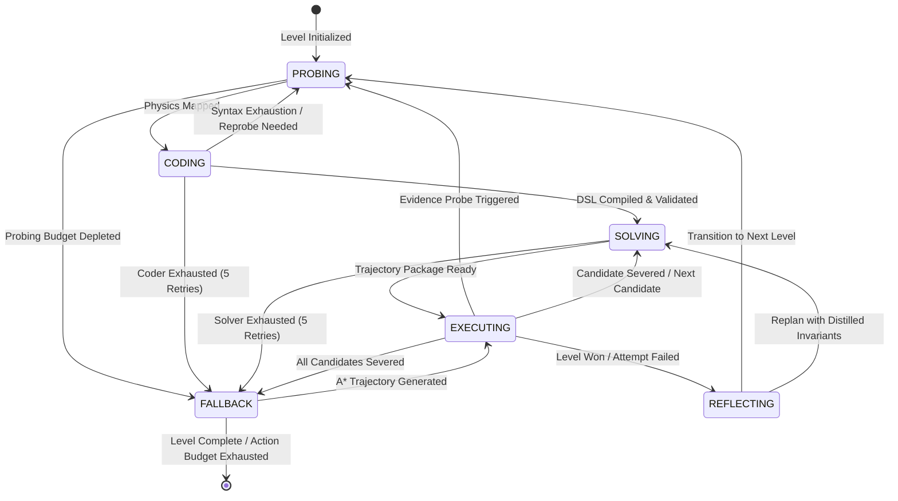

# ARC-AGI-3 LCLD Agent
# Architectural Specification — Version 10.2
# (Neuro-Symbolic Tri-Agent Architecture, Brusentsov Entailment Logic, Stratified Memory Contours, Generalized A* Feature Search, VisibleCycle Loop Recovery & Production vLLM Runtime)

---

## 0. Purpose and Architectural Vision

This document defines the authoritative architecture of the **ARC-AGI-3 LCLD (Locally Constrained Learning and Discovery) Agent (Version 10.2)**. The agent is engineered to autonomously solve diverse, completely unseen ARC-AGI-3 interactive grid tasks under the official Kaggle competition runtime constraints:

1. **Unknown Mechanics & Hidden Rules**: No pre-programmed rules, object identities, goal definitions, or physics models are provided. Every environment must be empirically identified, modeled, and solved entirely online.
2. **Hybrid Action Spaces (A+B)**: Environments may feature discrete directional buttons (`ACTION1..5`), spatial coordinate clicks (`ACTION6`), or a seamless mixture of both within the same level or across levels.
3. **Strict Offline Competition Constraints**: Kaggle evaluation environment with zero internet access, maximum artifact notebook size under 985 KB, fixed GPU resources (NVIDIA H100 / RTX 6000 Ada), 12-hour total competition wall-clock limit, and a maximum of 5000 seconds per game.
4. **Offline Local LLM Deployment (Qwen 3.8 27B via vLLM)**: Reasoning is performed by an offline instance of Qwen 3.8 27B served locally via vLLM with FlashAttention-2, Multi-Token Prediction (MTP=3) speculative acceleration, and specialized prompt engineering.
5. **Tri-Agent Authority Segregation**: Cognition is strictly divided among three distinct agent roles (**Explorer**, **Coder**, and **Solver**) operating through dedicated, non-overlapping memory contours.
6. **Strict Stratified Memory Hierarchy (ISO-1..ISO-10)**: Strict isolation contours eliminate cross-role hallucination, prevent goal leakage into physics modeling, and stratify cross-level learning into Foundational Physics (Tier 1), Interaction Dynamics (Tier 2), and Invariant Goals (Tier 3).
7. **Brusentsov 4-Valued Logic of Entailment**: Mathematical foundation based on N.P. Brusentsov’s non-paradoxical logic of entailment ($xy \lor xy'_0 \lor x'y'$), distinguishing necessary incompatibility (Carroll's nullity $xy'_0 \to \text{NULL}$) from benign inessentiality (omission/silence $\to \text{OMIT}$).
8. **Independent Symbolic Trajectory Execution**: Declarative candidate trajectories proposed by the Solver are executed deterministically step-by-step by the `SymbolicTrajectoryExecutor`, completely decoupling planning from execution.
9. **Multi-Candidate Package Synthesis & Clean RESET Traversal**: The Solver plans complete multi-step trajectory packages (up to 4 candidate paths per package) upfront, under a hard ceiling of 5 chain attempts per level (~10–20 trajectories total). Step-by-step LLM querying is **fundamentally prohibited**. Unsuccessful trajectories are severed, and subsequent candidates are tested from clean starting states ($S_0$) via environmental `RESET`.
10. **Generalized A* Search over Feature Differentials**: Symbolic fallback and heuristic repair operate via generic A* search over invariant feature vectors (centroid deltas, bounding box deltas, color matching, and object count deltas), eliminating hardcoded game-specific heuristics.
11. **Persistent Multi-Frame Object Tracking**: Object permanence across frames is maintained by `PersistentObjectTracker` via IoU overlap, centroid displacement, and confidence decay.
12. **Safe Evidence-Seeking Loop**: Epistemic uncertainty (`Verdict.UNDECIDED`) schedules targeted empirical probes without premature candidate branch severing.
13. **VisibleCycle Loop Recovery**: Orbit detection for periods 1..8 detects repeating state-action cycles before burning the level action budget, severs the loop, and triggers clean replanning.
14. **Production Time Budgeting & Resilient vLLM Serving**: Absolute deadline tracking with 15-second reserves prevents timeouts; background watchdog and sub-second socket-based teardown ensure serving stability.

---

### 0.1 What the Architecture Is NOT

- **NOT a monolithic LLM game player**: The LLM is never prompted with "What action do you want to take next?" on every frame. Such approaches suffer catastrophic hallucination, high latency, context explosion, and rapid budget depletion.
- **NOT a step-by-step solver**: The Solver plans complete multi-step trajectories upfront. The deterministic symbolic executor carries out execution step-by-step, verifying world laws at every transition.
- **NOT an unconstrained code executor**: The Coder synthesizes Python DSL implementations that are verified by an AST whitelist parser and executed inside a restricted memory/CPU sandbox. Arbitrary Python execution is blocked.
- **NOT a reinforcement learning policy**: The agent requires zero training frames, weight updates, or offline learning loops.
- **NOT hardcoded for specific games**: No heuristics tailored to specific benchmark puzzles (e.g. `ar25`, `ft09`) exist. All invariant rules are deduced online from empirical observations.
- **NOT dependent on `ACTION7`**: By competition rules, `ACTION7` is a hardcoded step-reversal (`Undo`). The agent fundamentally excludes `ACTION7`, maintaining epistemic consistency strictly through forward deterministic planning and clean state resets ($S_0$).

---

### 0.2 Normative Authority Hierarchy

Operational authority in the agent is strictly ordered from highest to lowest:

```
1. Gateway & Competition Contracts (Arcade step/reset interface, GAME_OVER protocol)
                                 │
2. Brusentsov LayeredVerifier (Strict 8-Tier Decision Cascade: FOLLOW / NULL / OMIT / UNDECIDED)
                                 │
3. GameSession Orchestrator (State machine, action budgets, cycle recovery, time budgeting)
                                 │
4. SymbolicTrajectoryExecutor (Deterministic execution controller, sandbox caller, circuit-breaker)
                                 │
5. VerificationBinder Contracts (Grounds declarative steps strictly against the PlanningSet)
                                 │
6. Solver Agent (Declarative planning: packages multi-step trajectories and distills invariants)
                                 │
7. Coder Agent (Synthesizes sandboxed Python DSL implementations from factual specs)
                                 │
8. Explorer Agent (Probes primitive actions and coordinate affordances; extracts factual rules)
                                 │
9. ARGA-Lite, PersistentObjectTracker & PlanningSet (Deterministic perception and tracking)
                                 │
10. Isolated Memory Stores (EnvironmentSpecMemory, SyntaxErrorMemory, EpistemicMemory, GameMemory)
```

No raw text or candidate action generated by an LLM is ever sent directly to the environment. Every action must be verified against world laws, bound through formal contracts, and emitted one transition at a time.

---

## 1. Theoretical Foundation: Brusentsov's Logic of Entailment

### 1.1 The Epistemic Flaw of Classical Material Implication

Standard two-valued mathematical logic, founded on Boolean algebra and the truth-functional definition of material implication:
$$(x \to y) \equiv \neg x \lor y \equiv x' \lor y$$
introduces fatal paradoxes when applied to autonomous empirical reasoning and invariant deduction:

1. **Ex Falso Quodlibet (Truth from Falsehood)**: Under material implication, if premise $x$ is false ($x = 0$), the formula $(x \to y)$ evaluates to `TRUE` regardless of whether conclusion $y$ is true, false, or physically impossible.
2. **Vacuous Truth in Verification**: If an agent formulates an invariant rule "If object $A$ moves right, its color changes to red", and the agent performs an action where object $A$ does not move, classical logic treats the rule as completely verified and confirmed ($1$). In reality, the observation provided **zero evidence** regarding the validity of the rule.
3. **Loss of Necessary Consequence**: Material implication denotes mere non-exclusion (possibility) rather than necessary consequence.

In his seminal work *"Усовершенствование логики умозаключений"* (2012), **Nikolay Petrovich Brusentsov** demonstrated that Aristotle's original syllogistic entailment $Axy$ ("All $x$ are $y$", "y belongs to every x", $x = xy$ — *из $x$ необходимо следует $y$*) was distorted by modern logicians who forced a two-valued reduction upon an inherently three-valued relation.

---

### 1.2 Carroll's Nullity and Aristotle's Universe of Discourse

Brusentsov recovered the genuine relation of entailment using the biliteral and indexical methods of Lewis Carroll:

1. **Elementary Characteristics and Coexistence of Opposites**:
   In Aristotle's universe of discourse ($\text{УА}$), every primary characteristic $x$ necessarily coexists with its opposite $x'$ ($x \neq 0, x' \neq 0$). Their coexistence is subject to mutual incompatibility:
   $$xx'_0, \quad yy'_0, \quad zz'_0$$
   where the prime symbol ($'$) denotes opposition, and subscript index "$0$" denotes the **nullity (incompatibility / non-existence)** of the conjunction.

2. **The Entailment Relation as Incompatibility**:
   To state that $y$ necessarily follows from $x$ ($x \Rightarrow y$) means that the essence of $y$ is entirely contained within the essence of $x$ ($x = xy$).
   Consequently, it is physically and logically impossible for $x$ to exist without $y$ (i.e. for $x$ to coexist with $y'$):
   $$(x \Rightarrow y) \equiv xy'_0$$
   Taking into account contraposition ($(x \Rightarrow y) \equiv (y' \Rightarrow x')$), Carroll's complete formula for entailment is:
   $$(x \Rightarrow y)(y' \Rightarrow x') \equiv x_1 y'_0 \land y'_1 x_0 \equiv xy'_0$$

3. **Material Implication vs. Entailment**:
   Material implication $(x \to y)$ can be expanded algebraically:
   $$(x \to y) \equiv (x \Rightarrow y) \lor x'y \equiv xy \lor xy'_0 \lor x'y \lor x'y'$$
   Material implication includes the term $x'y$ (where $x$ is absent and $y$ is present) as an explicitly affirmed truth condition. In necessary entailment, $x'y$ does not constitute part of the entailment relationship.

---

### 1.3 Overcoming the Incompleteness of Disjunctive Normal Form (DNF)

A central insight of Brusentsov’s theory is the **fundamental distinction between inessentiality (omission) and exclusion (incompatibility)**:

* **In Classical Boolean Algebra**: Omission of a conjunction term from a DNF formula implicitly signifies its **exclusion (falsity / non-existence)**.
* **In Brusentsov’s Three-Valued Algebra**:
  * **Exclusion (Incompatibility)** must be explicitly designated by Carroll's nullity index **«0»** ($xy'_0$).
  * **Affirmation (Coexistence)** is designated by unindexed terms ($xy$).
  * **Omission (Silence / Умалчивание)** signifies **inessentiality (несущественность / irrelevance)**: the relationship holds regardless of whether the omitted term occurs or does not occur.

Thus, the relation of necessary entailment ($x \Rightarrow y$) is represented by the **three-valued DNF**:
$$x \Rightarrow y \equiv xy \lor xy'_0 \lor x'y'$$
where the term $x'y$ is **omitted as inessential**. 

| Term | Algebraic Status | Semantics in Logic of Entailment | Semantics in LCLD Agent Verifier |
| :--- | :--- | :--- | :--- |
| **$xy$** | Unindexed | Necessary coexistence: premise and conclusion both occur. | **`FOLLOW (+1)`**: Positive confirmation of physical expectation. |
| **$xy'_0$** | Indexed with «0» | Strict incompatibility: premise occurs, conclusion fails. | **`NULL (-1)`**: Invariant contradiction. Candidate branch severed. |
| **$x'y$** | Omitted | Inessential: premise does not occur; conclusion occurs. | **`OMIT (0)`**: Neutral transition. Candidate branch preserved. |
| **$x'y'$** | Unindexed | Coexistence of opposites: neither premise nor conclusion occurs. | **`OMIT (0)`**: Neutral transition. World state unaffected. |

---

### 1.4 The 4-Valued Decision Semantics of `LayeredVerifier`

In real ARC-AGI-3 environments, observations are subject to **partial observability** (hidden layers, occluded entities, ambiguous affordances). To handle partial observability without violating Brusentsov’s axioms, the agent extends ternary logic into a **4-valued epistemic decision system**:

```
                                  Transition Result Evaluated
                                              │
                    ┌─────────────────────────┴─────────────────────────┐
                    │                                                   │
             Contradiction                                        No Contradiction
                    │                                                   │
             ┌──────┴──────┐                                     ┌──────┴──────┐
             │  VERDICT:   │                                     │             │
             │    NULL     │                           Expectation Met?        Ambiguity
             │    (-1)     │                                     │             Detected?
             └─────────────┘                        ┌────────────┴───────────┐         │
               Incompatibility                      │                        │         │
                 $xy'_0$                           YES                       NO        ▼
                                                    │                        │   ┌───────────┐
                                              ┌─────┴─────┐            ┌─────┴───┤ VERDICT:  │
                                              │ VERDICT:  │            │VERDICT: │ UNDECIDED │
                                              │  FOLLOW   │            │  OMIT   │   (SEEK)  │
                                              │   (+1)    │            │  (0)    └───────────┘
                                              └───────────┘            └─────────┘ Epistemic
                                               Entailment              Omission    Ambivalence
                                                  $xy$                   $x'y$
```

1. **`Verdict.FOLLOW (+1)` (Entailment Confirmed, $xy$)**:
   - The executed action caused the explicit state change predicted by the grounded step's `EXPECT:` proposition (all expected propositions necessarily contained in observed transitions).
   - Physical progression is affirmed. The candidate trajectory advances its execution cursor (`cursor += 1`).

2. **`Verdict.OMIT (0)` (Inessentiality / Neutral Omission, $x'y$)**:
   - The action produced no contradiction with known physical world laws, but did not trigger the specific expected delta (e.g. passive interaction, non-essential background shift).
   - **Crucial Invariant (ISO-10)**: In accordance with Brusentsov's principle, inessentiality does **not** signify falsehood. The active candidate trajectory is **NEVER severed** on an `OMIT` verdict, and execution advances safely.

3. **`Verdict.NULL (-1)` (Incompatibility / Falsification, $xy'_0$)**:
   - The action directly contradicted an established physical invariant (e.g. moving through an impassable boundary, moving opposite to confirmed kinematics, violating area or color conservation, or generating zero grid delta on a confirmed motion action).
   - The active candidate trajectory is **immediately severed (`sever()`)**. The orchestrator schedules a clean environment reset (`RESET` $\to S_0$) to prevent dirty-board cascading.

4. **`Verdict.UNDECIDED` (Epistemic Ambivalence / Partial Observability)**:
   - Emitted when empirical evidence is insufficient to distinguish between entailment and contradiction:
     a) Bipartite track matching cost difference between best and second-best candidate is $< \text{matching\_ambiguity\_threshold}$ (0.15).
     b) Any participating `TrackedObject` exhibits confidence $< \text{track\_confidence\_threshold}$ (0.60).
     c) Zero grid delta observed on a non-confirmed action carrying a non-empty `EXPECT` set.
     d) Detected change metrics have magnitudes $< \text{min\_reliable\_delta}$ (0.8 px) without terminal completion.
   - **Ablation Invariant**: When `enable_undecided_verdict = False`, all four conditions above map conservatively to `Verdict.OMIT`, maintaining classic 3-valued operation.

---

### 1.5 Evidence-Seeking Finite State Machine (E-FSM)

When `Verdict.UNDECIDED` is emitted, candidate trajectory execution is suspended, entering an active evidence-seeking loop:

1. **State Snapshotting & Execution Freezing**:
   - The orchestrator captures an immutable snapshot of the active step: `pending_step_snapshot = active_step`.
   - `evidence_seeking_active = True` is engaged.
   - The candidate execution cursor is **frozen** (`candidate_advanced = False`, `candidate_severed = False`).

2. **Blocking `act()` Action Arbitration**:
   - While `evidence_seeking_active` is true, `act()` is strictly blocked from advancing the trajectory or invoking the Solver.
   - If `evidence_probes_remaining > 0`, a targeted probe action (derived from `judgment.evidence_hint` or a generic diagnostic pulse) is placed at the head of `probe_queue` and emitted.
   - If `probe_queue` is exhausted, `act()` emits a deterministic `NOOP` action (`action_id="NOOP"`), preventing arbitrary exploration during verification.

3. **Post-Probe Re-evaluation Semantics**:
   - Upon observing the post-probe state, the transition is **not** re-applied from the pre-probe state.
   - Instead, the verifier re-checks whether the epistemic ambiguity condition on `pending_step_snapshot` has resolved in the new observation.
   - If ambiguity is resolved: `evidence_seeking_active` is cleared, and trajectory execution resumes cleanly from the current step.
   - If ambiguity persists: `undecided_streak` increments.

4. **Streak Limitation & Budget Exhaustion**:
   - If `undecided_streak` reaches `max_undecided_streak = 2` or `evidence_probes_remaining` reaches 0, the step is treated as **`Verdict.NULL`**.
   - The candidate is severed, triggering a clean environmental `RESET` $\to S_0$. `replan_requested` is NOT set until the entire candidate pool is exhausted.
   - Evidence probes consume their own dedicated quota (`max_evidence_probes_per_level = 2`) and **never** decrement the primary level chain attempt budget.

---

## 2. Tri-Agent Separation of Powers

To guarantee zero cross-contamination, cognitive responsibilities are strictly partitioned among three specialized LLM call families:

```
                      ┌─────────────────────────────────────────┐
                      │               GameSession               │
                      │      (State Machine & Orchestrator)     │
                      └───────┬────────────┬────────────┬───────┘
                              │            │            │
                  Empirical   │     Syntax │ Declarative│ Multi-Candidate
                  Probing     │  Synthesis │   Planning │ Packages
                              ▼            ▼            ▼
                       ┌────────────┐┌────────────┐┌────────────┐
                       │  Explorer  ││   Coder    ││   Solver   │
                       │   Agent    ││   Agent    ││   Agent    │
                       └──────┬─────┘└─────┬──────┘└─────┬──────┘
                              │ Writes     │ Writes      │ Writes
                              ▼ Only       ▼ Only        ▼ Only
                       ┌────────────┐┌────────────┐┌────────────┐
                       │  EnvSpec   ││SyntaxError ││ Epistemic  │
                       │   Memory   ││   Memory   ││   Memory   │
                       └────────────┘└────────────┘└────────────┘
                              ▲            ▲             ▲
                              └────────────┴─────────────┘
                                  Strictly Quarantined
```

### 2.1 Explorer Agent (Call Family 1: Empirical Fact Discovery)
* **Mission**: Probe available actions (`ACTION1..5`) and spatial coordinates (`ACTION6`) on the pristine board ($S_0$) to extract deterministic action kinematics and selection affordances.
* **Memory Ownership**: Writes exclusively to `EnvironmentSpecMemory`.
* **Prohibitions**: **Must not** formulate puzzle goals, hypothesize winning conditions, or plan multi-step paths.
* **Output Contract**: Valid JSON payload adhering to schema `v10.env_spec.1`.

#### System Prompt (`EXPLORER_SYSTEM_PROMPT`):
```text
You are the Explorer Agent for an ARC-AGI-3 environment.
Your task is purely empirical discovery: discover the physical rules, action effects, and coordinate affordances of the current level.

CRITICAL ARCHITECTURAL CONSTRAINTS:
1. You describe ONLY factual action effects and coordinate affordances.
2. You NEVER speculate on puzzle goals, winning conditions, or strategies.
3. You NEVER emit action sequences, solution plans, or step-by-step paths.
4. Output MUST be a valid JSON object matching schema 'v10.env_spec.1' enclosed in ```json ... ```.
5. Do NOT overgeneralize limited probe failures (e.g. if 2-3 probed coordinates showed no effect, do NOT conclude that clicking objects is impossible; describe the action's coordinate parameter format and note that active clickable entities across the board remain to be mapped).
```

---

### 2.2 Coder Agent (Call Family 2: Sandboxed DSL Synthesis)
* **Mission**: Translate the verified empirical facts from `EnvironmentSpecMemory` into a clean, typed Python Domain-Specific Language (DSL) module implementing high-level primitive operations.
* **Memory Ownership**: Writes exclusively to `SyntaxErrorMemory` upon compilation or runtime failure.
* **Prohibitions (ISO-2)**: **Strictly quarantined from goal definitions**. Does not know how to solve the puzzle, only how to manipulate objects according to the physics of the environment.
* **Execution Environment**: Compiled code is validated by `SafeASTVisitor` and executed inside `SandboxExecutor` under strict resource ceilings (10s CPU, 512MB RAM).

#### System Prompt (`CODER_SYSTEM_PROMPT`):
```text
You are the DSL Coder Agent for an ARC-AGI-3 environment.
Your task is to write a deterministic, typed Python module defining primitive actions, spatial reasoning helpers, and candidate state transitions based on discovered physics.

CRITICAL ARCHITECTURAL CONSTRAINTS:
1. Implement clean, type-annotated Python functions.
2. Every function MUST be accompanied by a JSON manifest declaring its signature and expected effect.
3. NEVER import unauthorized modules. Use only math, typing, and standard collections.
4. Output MUST contain:
   a) Python code block enclosed in ```python ... ```
   b) Manifest JSON block enclosed in ```json ... ``` matching schema 'v10.dsl_manifest.1'
5. Do NOT attempt to solve the puzzle or specify winning sequences. Provide ONLY mechanical primitives.
```

---

### 2.3 Solver Agent (Call Family 3: Declarative Planning & Reflection)
* **Mission (Turn-1 Planning)**: Propose a structured package of up to 4 distinct multi-step candidate trajectories expressed in terms of the Coder's DSL manifest, with explicit `EXPECT:` propositions for every step.
* **Mission (Turn-2 Reflection)**: Following level completion or attempt exhaustion, analyze outcomes and distill domain-general invariants categorized into `[PALETTE & ROLES]`, `[GOAL]`, `[ENTITIES]`, `[CONTROL]`, and `[PHYSICS]`.
* **Memory Ownership**: Reads from and writes to `EpistemicMemory` and `GameMemory`.
* **Prohibitions**: Never executes code, never emits raw actions directly to the environment, and never receives Python syntax error tracebacks.

#### System Prompt (`SOLVER_SYSTEM_PROMPT`):
```text
You are the Solver Agent for an ARC-AGI-3 environment.
Your task is declarative planning: formulate full candidate solution trajectories to solve the level, based on the PlanningSet, discovered physics, active domain invariants, and failed attempt history.

CRITICAL ARCHITECTURAL CONSTRAINTS:
1. Propose up to 4 complete multi-step candidate trajectories labeled <trajectory_1> through <trajectory_4>.
2. Each trajectory must consist of sequential steps formatted as:
   <action_id>(<arguments>) [EXPECT: <proposition>]
3. Trajectory Horizon & Repetition Syntax (count=N):
   - Level solutions typically require extended trajectories (often 20 to 30 sequential actions).
   - Use the repetition parameter `count=N` to repeat an action N times cleanly: e.g. `action1(count=15)` executes 15 consecutive moves (maximum 30).
   - Do not truncate to micro-probes; plan the full sequence needed to achieve victory directly.
4. Use ONLY functions and actions declared in the active DSL manifest and available action space.
5. Base reasoning strictly on PlanningSet objects, spatial relations (matching `steps_required`), and past failed attempt feedback.
6. Zero Few-Shot Anchor Bias: Prompt contains zero dummy step lines, preventing artificial plan truncation.
```

#### Reflection System Prompt (`SOLVER_TURN2_SYSTEM_PROMPT`):
```text
You are the Epistemic Reflection Solver for an ARC-AGI-3 curriculum.
Your task is to analyze the outcome of the completed level and distill domain-general invariants that carry forward across levels.

CRITICAL ARCHITECTURAL CONSTRAINTS:
1. Group distilled invariants under exact category tags:
   [PALETTE & ROLES]: Abstract functional roles of entities independent of specific colors.
   [GOAL]: High-level topological or alignment victory conditions.
   [ENTITIES]: Morphological invariants and object permanence rules.
   [CONTROL]: Action-to-entity mapping and selection toggle mechanics.
   [PHYSICS]: Collision rules, boundaries, and motion freedom laws.
2. Strip all specific button sequences, action macros, and level-specific pixel coordinates. Formulate rules as general principles.
3. Invalidate any prior invariants that were contradicted by observations.
```

---

## 3. Stratified 3-Tier Memory Architecture

To facilitate lifelong cross-level learning without context pollution, memory is stratified into three disjoint tiers:

```
┌─────────────────────────────────────────────────────────────────────────────┐
│                       Tier 3: High-Level Invariant Rules                    │
│     (Curriculum memory: topological victory conditions, alignment goals)    │
├─────────────────────────────────────────────────────────────────────────────┤
│                  Tier 2: Interaction Dynamics & Selection                   │
│   (Control mechanics: active entity toggle, selection indicators, triggers) │
├─────────────────────────────────────────────────────────────────────────────┤
│                    Tier 1: Foundational Physics & Kinematics                │
│    (Atomic laws: directional deltas, boundaries, collision dynamics, pass)  │
└─────────────────────────────────────────────────────────────────────────────┘
```

1. **Tier 1: Foundational Physics & Kinematics**:
   - Discovered through primitive probing; carries forward across levels within the same game.
   - Example: `ACTION1 moves active entity dy=-1, dx=0 until boundary`.
   - Protected: Never overwritten by goal formulations. Falsified only upon empirical conflict on $S_0$.

2. **Tier 2: Interaction Dynamics & Selection**:
   - Encodes modal controls, focus indicators, and entity switching.
   - Example: `ACTION5 cycles active controlled entity among pieces of color [COLOR]`.

3. **Tier 3: High-Level Invariant Rules & Curriculum**:
   - Synthesized by Solver Turn-2 reflection upon level completion.
   - Example: `[GOAL]: Align all mobile entities symmetrically along the central vertical axis`.
   - Abstracted: All color literals (`color 1`, `color 4`) are converted via `_generalize_text` to symbolic tokens (`[COLOR]`), ensuring transferability across levels with altered color schemes.

---

### 3.1 Architectural Isolation Invariants (ISO-1..ISO-10)

The integrity of the architecture is guarded by 10 non-negotiable invariants:

* **ISO-1 (Zero Syntax Tracebacks in Solver)**: Raw Python tracebacks, compiler errors, and AST violations are strictly confined to `SyntaxErrorMemory` and never leak into `EpistemicMemory` or Solver prompts.
* **ISO-2 (Curriculum Goal Quarantine for Coder)**: The Coder prompt and `EnvironmentSpecMemory` are strictly purged of all `[GOAL]` tags, target scores, and win conditions. Coder synthesizes mechanical manipulation primitives only.
* **ISO-3 (Sandbox Containment)**: All DSL code executes in an isolated subprocess with strict CPU, memory, and syscall restrictions.
* **ISO-4 (Immutable Perception Grounding)**: The `PlanningSet` extracted at frame $t$ is immutable. LLMs can refer to objects (`obj_0`, `obj_1`) but cannot mutate the underlying perceptual graph.
* **ISO-5 (Declarative Planning Purity)**: The Solver produces pure declarative text trajectories; it possesses no ability to invoke functions, mutate environment state, or inspect Python runtime state.
* **ISO-6 (Substantive Relation Filtering)**: Spatial relations in the `PlanningSet` are restricted to substantive entities ($area \ge 4$), eliminating combinatorial explosions from background cavities.
* **ISO-7 (Forward-Only Clean Reset Execution)**: Step reversal via `ACTION7` is prohibited. Erroneous paths are abandoned via environmental `RESET`, returning the system to pristine initial state $S_0$.
* **ISO-8 (Color Abstraction across Levels)**: Cross-level invariant memory automatically abstracts concrete palette indices into generalized tokens (`[COLOR]`), preserving structural topology across color perturbations.
* **ISO-9 (Epistemic Signal Segregation)**: `Verdict.UNDECIDED` signals are stored in transient `epistemic_signals`, completely separated from confirmed historical `judgments`.
* **ISO-10 (Non-Severance on Expectation Mismatch)**: An unfulfilled step expectation that does not violate any established physical invariant yields `Verdict.OMIT`, strictly preserving the surviving candidate trajectory.

---

### 3.2 Persistent Object Tracking & Change-Centric Propositions (`PersistentObjectTracker`)

To overcome the fragility of ephemeral object IDs between consecutive frames, the architecture grounds perception through a persistent identity tracker (`v10_agent/tracker.py`):

1. **Normalized 4-Part Bipartite Matching Cost**:
   Association between active track $T$ and newly perceived component $C$ is governed by:
   $$\text{Cost}(T, C) = 0.30 \cdot \text{color\_diff} + 0.40 \cdot \frac{\text{manhattan}(T, C)}{\max(H, W)} + 0.20 \cdot (1.0 - \text{Jaccard}(T, C)) + 0.10 \cdot \frac{|T_{\text{area}} - C_{\text{area}}|}{\max(T_{\text{area}}, C_{\text{area}}, 1)}$$
   - Matches are accepted if $\text{Cost}(T, C) < \text{track\_match\_threshold}$ (0.45).
   - Cost ties are resolved deterministically by lexicographic priority on `persistent_id`.

2. **Track Kinematics & Identity Permanence**:
   - **Confidence Metric**: Track confidence is defined as $\text{confidence} = 1.0 - \text{cost}$ (initialized to 1.0 upon spawn).
   - **Velocity Exponential Moving Average (EMA)**:
     $$\mathbf{v}_t = 0.3 \cdot (\mathbf{c}_t - \mathbf{c}_{t-1}) + 0.7 \cdot \mathbf{v}_{t-1}$$
   - **Shape Stability Decay**: If shape Jaccard $< 0.85$, stability decays: $\text{score} \leftarrow \text{score} \times 0.9$.
   - **History Ring Buffer & Cumulative Motion**: Tracks maintain a FIFO buffer of length $\text{cumulative\_window} + 1$ (4). Cumulative displacement over the window is computed as:
     $$\Delta_{\text{cum}} = \mathbf{c}_{\text{newest}} - \mathbf{c}_{\text{oldest}}$$
   - **Occlusion Detection**: An unmatched track is flagged `occluded = True` if an overlapping/nearby component of larger area exists within $\text{occlusion\_radius}$ (3 px). Occluded tracks have extended lifecycle ($2 \times \text{track\_max\_age} = 10$ frames).

3. **Key Architectural Definitions**:
   - **"Compatible Effect Signature" (Confirmed Motion)**: A confirmed action effect is classified as motion (triggering zero-delta NULL checks) iff it contains at least one of `{"dy=", "dx=", "moved", "displace"}` and none of `{"blocked", "wall", "no_effect", "null"}`.
   - **"Participating TrackedObject"**: A track is subject to the low-confidence `UNDECIDED` threshold iff its `persistent_id` appears in the step's expected propositions or in observed propositions carrying non-zero delta (including $\Delta_{\text{cum}} \neq (0, 0)$).
   - **"False Null Suspects" Metric**: Measurable fraction of `NULL` verdicts where a subsequent probe recovers the identical entity within $\le 1$ pixel of the failure centroid.

4. **Change-Centric Proposition Families**:
   - `cumulative_motion`: `value = (dy_total, dx_total)`
   - `shape_stability`: `predicate = "shape_stable" | "shape_changed"`, `value = stability_score`
   - `object_identity`: `predicate = "occluded"`, `secondary_id = occluded_by`

---

## 4. Master Orchestration & State Machine

Session execution is governed by an explicit Finite State Machine (`SessionPhase`):



### 4.1 Multi-Candidate Trajectory Traversal via Clean RESET

When the Solver produces a trajectory package containing candidates $\langle T_1, T_2, T_3, T_4 \rangle$:

1. Trajectory $T_1$ is selected as the active candidate.
2. `SymbolicTrajectoryExecutor` executes steps of $T_1$ one by one:
   - Step $s_i$ is translated to native action and executed in the environment.
   - `LayeredVerifier` evaluates transition $(S_{i-1}, a_i, S_i)$.
   - If `Verdict.FOLLOW` or `Verdict.OMIT`: $T_1$ continues to $s_{i+1}$.
   - If `Verdict.NULL`: $T_1$ is **severed** (`T1.sever()`).
3. Upon candidate severance:
   - Orchestrator checks if unsevered candidates remain in the pool ($T_2, T_3, \dots$).
   - If available: environmental `RESET` is dispatched to restore the board to clean state $S_0$, and $T_2$ becomes active.
   - If all candidates are severed: replanning is requested (`replan_requested = True`). If level attempts remain ($< 5$), Solver Turn-1 is invoked with updated failed-attempt feedback in `EpistemicMemory`.
   - If level attempts are exhausted ($= 5$): the agent transitions to deterministic `SymbolicFallbackEngine` (A* search).

---

### 4.2 Tufa-Loop Invariant and Single-RESET `GAME_OVER` Protocol

When the environment emits `state == "GAME_OVER"`:
1. **The Single-RESET Contract**: In compliance with the competition environment protocol, exactly **one** `RESET` action must be emitted to restart the level.
2. **Preservation of Viable Candidates**: Receiving `GAME_OVER` severs **only** the active candidate trajectory that caused the loss. It does **not** wipe the entire trajectory pool. If candidate $T_2$ is available, the single `RESET` restores $S_0$, and execution immediately resumes with $T_2$.
3. **Engine Action Tracking (`last_engine_action_source`)**: The orchestrator differentiates between an environment auto-reset (`tufa_auto_reset`) and an intentional candidate reset (`candidate_reset`), preventing accidental double-reset traps.
4. **Retry Exhaustion**: If a level accumulates 5 consecutive `GAME_OVER` resets, further retries are terminated cleanly (`LevelAttemptsExhaustedError`), preventing infinite looping.

---

### 4.3 Cross-Level Invariant Discovery on Pristine Frames ($S_0$)

Invariants accumulated from earlier levels must be evaluated against the new level without bias:
* **Pristine Frame Evaluation**: Cross-level invariant re-evaluation is **never** executed on the victory frame of the prior level.
* When `handle_level_transition(new_level_id)` is called, the orchestrator sets `pending_cross_level_re_evaluation = True`.
* The actual evaluation occurs strictly during the first `act()` call on the pristine initial observation frame of the new level ($S_0$, `level_initial_grid is None`).
* Invariants that contradict $S_0$ are immediately invalidated; compatible invariants form the starting knowledge base for the new level.

---

## 5. Competition Reliability Infrastructure (Flash Port)

### 5.1 VisibleCycle Loop Recovery (`cycle_detector.py`)

To prevent the agent from burning the 250-action level budget in infinite closed loops (e.g. oscillating between two tiles or cycling endlessly around an obstacle), the architecture incorporates the `VisibleCycle` detector:

1. **State-Action Orbit Tracking**:
   The detector records transitions as tuples:
   $$(\text{hash}(S_{t-1}), \text{ACTION}, \text{hash}(S_t))$$
   where grid hashing uses fast row-level MD5 hashing (`_hash_grid`).

2. **Orbit Detection Criteria**:
   A cycle is flagged if a closed block of length $P$ ($1 \le P \le 8$) repeats identically $R$ times:
   $$P \cdot R \ge \text{min\_actions} \quad (24), \quad R \ge \text{min\_cycles} \quad (4)$$
   The block must form a closed topological orbit:
   $$\text{hash}(S_{\text{start}}) == \text{hash}(S_{\text{end}})$$

3. **Intervention and Circuit Breaking**:
   - Upon cycle detection, if interventions on the current level are below limit ($\le 2$):
   - The active candidate trajectory is immediately severed.
   - A failure record is inscribed into `EpistemicMemory` (`CYCLE_REJECTED`).
   - `solver_reset_pending = True` is triggered with reason `"loop_recovery_cycle_reset"`.
   - The environment is reset to $S_0$, and replanning is forced with explicit cycle-avoidance constraints.

---

### 5.2 Deadline Management & Dynamic Time Budgeting

To safeguard the 5000-second per-game and 30600-second competition budgets:
1. **Configured Reserves**:
   - `deadline_reserve_seconds = 15.0`: Critical safety margin before game timeout.
   - `notebook_reserve_seconds = 600.0`: Safety margin before Kaggle 12-hour session kill.
2. **LLM Generation Abort**:
   Before initiating any chat completion request in `VLLMAdvisor`, `config.is_deadline_exceeded()` is checked. If remaining time is $\le 15.0$ seconds, the call is aborted immediately, returning `"{}"` to allow the orchestrator to execute a clean exit without hanging.
3. **Socket Timeout Clamping**:
   Network socket timeouts for vLLM requests are dynamically clamped:
   $$\text{timeout} = \min(\text{base\_timeout}, \max(2.0, \text{remaining\_time} - 15.0))$$
4. **Harness Termination**:
   In `lcld_competition_child.py`, if remaining time falls below reserve, the game loop breaks cleanly with `stop_reason = "deadline_reserve"`, committing the final submission parquet.

---

### 5.3 vLLM Serving Architecture, Watchdog & Teardown

The local inference engine uses vLLM running in an isolated background process managed by `serving_setup.py`, `vllm_server_watchdog.py`, and `serving_teardown.py`:

1. **Approved Competition Server CLI Flags**:
   The vLLM server is initialized with strictly validated production flags:
   * `--no-enable-prefix-caching`: Disables KV prefix caching, eliminating memory fragmentation and CUDA graph replay issues under concurrent requests.
   * `--enable-chunked-prefill` + `--async-scheduling`: Prevents long prompt prefilling from starving active token generation.
   * `--no-enable-log-requests` + `--disable-uvicorn-access-log`: Suppresses high-frequency request logging, preventing stdout/stderr buffer saturation.
   * `--max-model-len 131072`: Full 128K context window for complex multi-turn trajectories.
   * `--tensor-parallel-size 1`: Optimized single-GPU allocation.
   * `--gpu-memory-utilization 0.95`: Maximum dedicated VRAM allocation for KV-cache.

2. **Watchdog Health Probe (`vllm_server_watchdog.py`)**:
   - Runs a dedicated background daemon thread probing `http://127.0.0.1:8000/health` every 15 seconds.
   - Uses `threading.RLock` to eliminate deadlock hazards during concurrent health checks and process management.
   - If 4 consecutive health checks fail, the watchdog triggers automated server restart (up to 2 attempts per session).

3. **Sub-Second Process Teardown (`serving_teardown.py`)**:
   - Pre-tests serving port via an instantaneous socket probe (timeout: 0.05s).
   - If the port is closed, teardown exits in $<1$ ms without invoking expensive shell processes (`netstat`/`lsof`/`fuser`).
   - If the port is open, process trees are terminated gracefully (`SIGTERM`), followed by force kill (`SIGKILL`) if unresponsive after 5 seconds.
