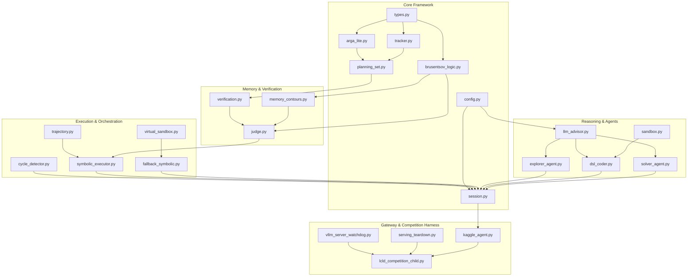

# ARC-AGI-3 LCLD Agent
# Engineering Specification — Version 10.2
# (Exhaustive Implementation Blueprint: Core Source Files, Brusentsov Entailment Operators, Generalized A* Heuristics, Multi-Frame Identity Tracking, Loop Recovery & Production vLLM Runtime)

---

## 0. Engineering Objective & Implementation Contracts

This document provides the complete, authoritative implementation specification for the **ARC-AGI-3 LCLD Agent (Version 10.2)**. Any software engineer possessing standard Python 3.12 tools must be able to recreate, test, and deploy the entire codebase from scratch using only this document and the accompanying Architectural Specification, without ambiguity or external dependencies.

### 0.1 Key Engineering Contracts

1. **Deterministic Perception**: ARGA-Lite object extraction, topological cavity detection, substantive spatial relation filtering, and multi-frame identity tracking via `PersistentObjectTracker`.
2. **Tri-Agent Role Hierarchy**: Independent LLM call families for Explorer, Coder, and Solver enforced by strict ISO-1 through ISO-10 memory isolation invariants (including ISO-2 goal quarantine for Coder).
3. **Stratified 3-Tier Memory Contours**:
   - Tier 1: Foundational Physics & Directional Kinematics (`EnvironmentSpecMemory`).
   - Tier 2: Interaction Dynamics & Selection Controls (`GameMemory`).
   - Tier 3: High-Level Invariant Rules & Curriculum (`GameMemory.curriculum_invariants`).
4. **Brusentsov 4-Valued Logic Engine**: Mathematical realization of 4-valued judgments (`FOLLOW: +1`, `OMIT: 0`, `NULL: -1`, `UNDECIDED: SEEK`) in `v10_agent/brusentsov_logic.py`, strict 8-tier decision cascade in `v10_agent/judge.py`, default verdict `Verdict.OMIT`, and ISO-10 candidate non-severance.
5. **Generalized A* Search over Feature Differentials**: Replacement of hardcoded heuristics with a general A* heuristic operating over centroid displacement, bounding box deltas, color match ratio, and object count deltas (`v10_agent/virtual_sandbox.py`).
6. **Multi-Trajectory Candidate Pool Traversal**: Solver plans complete multi-step trajectory packages upfront (up to 4 candidate paths per package); execution is handled deterministically step-by-step by `SymbolicTrajectoryExecutor` with clean environmental resets (`RESET` $\to S_0$) between candidates under a hard limit of 5 attempts per level.
7. **Pristine Frame Invariant Discovery**: Cross-level invariant re-evaluation is deferred to the pristine initial frame of the new level ($S_0$, `level_initial_grid is None`).
8. **VisibleCycle Loop Recovery**: Fast row-level MD5 hashing detecting repeating state-action orbits (periods 1..8, $\ge 4$ repetitions, $\ge 24$ actions) with automatic candidate severance and clean reset (`v10_agent/cycle_detector.py`).
9. **Time Budgeting & Deadline Safety**: Dynamic time tracking with a 15-second reserve; automatic LLM request abort upon reserve breach; socket timeout clamping; and graceful competition child exit (`v10_agent/config.py`, `v10_agent/llm_advisor.py`, `lcld_competition_child.py`).
10. **vLLM Serving Infrastructure**: Strictly validated production flags (`--no-enable-prefix-caching`, `--enable-chunked-prefill`, `--async-scheduling`, `--no-enable-log-requests`, `--disable-uvicorn-access-log`), non-blocking watchdog (`vllm_server_watchdog.py`), and sub-millisecond socket teardown (`serving_teardown.py`).

---

## 1. File Hierarchy & Dependency Graph

The production deployment consists of 35 files organized as follows:

```
c:/arcprize/
├── kaggle_agent.py                             # Competition gateway adapter (ARC_AGI_Agent)
├── submission.py                               # Configuration defaults and canonical enum mappers
├── lcld_competition_child.py                   # Isolated child process runner & game execution loop
├── lcld_preflight.py                           # Structural preflight verification suite
├── phase_a_heavy_smoke.py                      # Offline wheelhouse installer & dynamic vLLM server
├── serving_setup.py                            # Flash-Next compatible serving lifecycle manager
├── serving_teardown.py                         # Sub-millisecond socket probe & process teardown
├── vllm_server_watchdog.py                     # Non-blocking RLock health watchdog daemon
├── build_notebook_v10.py                       # Self-extracting LZMA base64 notebook builder
│
└── v10_agent/
    ├── __init__.py                             # Package exports and version metadata
    ├── action_adapter.py                       # Native ActionInput and arcade dict converters
    ├── arga_lite.py                            # Deterministic ARGA-Lite perception & relation engine
    ├── brusentsov_logic.py                     # Brusentsov 4-valued Verdict, logic operators & judgments
    ├── config.py                               # V10Config dataclass, deadline tracker & CLI builder
    ├── cycle_detector.py                       # VisibleCycle orbit detector & MD5 grid hasher
    ├── dsl_coder.py                            # Coder Agent (Call 2) & SandboxedModule compiler
    ├── explorer_agent.py                       # Explorer Agent (Call 1) & PrimitiveProbeManager
    ├── fallback_symbolic.py                    # Deterministic fallback engine wrapping A* search
    ├── frame_media.py                          # Dual-view visualization: raw & annotated PNG renderers
    ├── game_adapter.py                         # Game session interface adapters
    ├── judge.py                                # LayeredVerifier with strict 8-tier decision cascade
    ├── llm_advisor.py                          # LLM client (vLLM OpenAI API, streaming, timeout clamp)
    ├── logging.py                              # Structured JSON audit and session logger
    ├── memory_contours.py                      # Stratified 3-tier memory stores & ISO validators
    ├── observe.py                              # Observation normalization and 1px border cropping
    ├── planning_set.py                         # Immutable PlanningSet, PlanningObject & SpatialRelation
    ├── policy.py                               # Action arbitration policy
    ├── sandbox.py                              # Restricted AST validator & SandboxExecutor
    ├── session.py                              # Master GameSession orchestrator & state machine
    ├── solver_agent.py                         # Solver Agent (Call 3), XML trajectory parser & reflection
    ├── symbolic_executor.py                    # Independent SymbolicTrajectoryExecutor controller
    ├── tracker.py                              # PersistentObjectTracker & TrackedObject permanence
    ├── trajectory.py                           # CandidateTrajectory, GroundedStep & TrajectoryPool
    ├── types.py                                # Core types: Grid2D, BoundingBox, Centroid, Propositions
    ├── universal_invariants.py                 # Universal algebraic & collinear axial invariant discovery
    ├── verification.py                         # VerificationBinder & PropositionSet grounding
    ├── verifier_packet.py                      # Structured symbolic verifier exchange packet
    ├── virtual_sandbox.py                      # Generalized A* search over feature differentials
    │
    └── prompt_builders/
        ├── __init__.py                         # Prompt builder exports
        ├── coder_prompt.py                     # DSL implementation prompt templates
        ├── explorer_prompt.py                  # Probing and coordinate hypothesis templates
        └── solver_prompt.py                    # Declarative multi-candidate planning templates
```

### 1.1 Dependency Graph



---

## 2. Configuration Contract (`v10_agent/config.py`)

All runtime options, budgets, server flags, and deadline thresholds are consolidated in `V10Config`:

```python
@dataclass
class V10Config:
    # LLM Backend & Model Configuration
    llm_advisor_backend: str = "vllm"                      # "vllm" | "fake" | "dashscope" | "ollama"
    model_path: str = "Qwen/Qwen3.8-27B"
    qwen_model_path: str = "Qwen/Qwen3.8-27B"
    vllm_base_url: str = "http://127.0.0.1:1234/v1"
    qwen_vllm_base_url: str = "http://127.0.0.1:1234/v1"
    vllm_api_key: str = "EMPTY"
    qwen_vllm_api_key: str = "EMPTY"
    context_tokens: int = 131072
    qwen_context_tokens: int = 131072
    max_input_tokens: int = 65536
    qwen_max_input_tokens: int = 65536
    max_output_tokens: int = 32000
    qwen_max_output_tokens: int = 32000
    temperature: float = 1.0
    qwen_temperature: float = 1.0
    top_p: float = 0.95
    qwen_top_p: float = 0.95
    top_k: int = 20
    qwen_top_k: int = 20
    seed: int = 42
    qwen_seed: int = 42
    timeout_seconds: int = 700
    qwen_timeout_seconds: int = 700
    multimodal_enabled: bool = True
    qwen_multimodal_enabled: bool = True
    solver_multimodal_enabled: bool = True
    explorer_multimodal_enabled: bool = True
    coder_multimodal_enabled: bool = True
    enable_thinking: bool = True
    qwen_enable_thinking: bool = True
    reasoning_strength: str = "xhigh"
    reasoning_budget_tokens: int = 32000
    qwen_reasoning_budget_tokens: int = 32000

    # Multi-Token Prediction (MTP=3) Speculative Decoding
    vllm_mtp_enabled: bool = True
    vllm_mtp_tokens: int = 3
    vllm_speculative_method: str = "mtp"
    vllm_speculative_model: str | None = None
    vllm_speculative_config: str | None = None
    vllm_speculative_cli_format: str = "auto"              # "auto" | "config_json" | "spec_tokens" | "speculative_model"

    # vLLM Server Launch Parameters (Unified Runtime)
    vllm_enable_prefix_caching: bool = False
    vllm_enable_chunked_prefill: bool = True
    vllm_async_scheduling: bool = True
    vllm_no_enable_log_requests: bool = True
    vllm_disable_uvicorn_access_log: bool = True

    # Persistent Object Tracker & 4-Valued Verdict Knobs
    enable_persistent_tracker: bool = True
    track_match_threshold: float = 0.45
    track_max_age: int = 5
    matching_ambiguity_threshold: float = 0.15
    min_reliable_delta: float = 0.8
    track_confidence_threshold: float = 0.6
    occlusion_radius: int = 3
    cumulative_window: int = 3
    enable_undecided_verdict: bool = True
    max_undecided_streak: int = 2
    max_evidence_probes_per_level: int = 2

    # Deadline Reserve & Time Budgeting (Flash Port)
    deadline_reserve_seconds: float = 15.0
    notebook_reserve_seconds: float = 600.0
    _deadline_time: float | None = None

    # VisibleCycle Loop Recovery (Flash Port)
    enable_cycle_detector: bool = True
    cycle_detector_min_actions: int = 24
    cycle_detector_max_period: int = 8
    cycle_detector_min_cycles: int = 4
    cycle_detector_per_level_limit: int = 2

    # Memory Contours & Isolation
    game_memory_reset_on_game_change: bool = True
    game_memory_reset_on_level_change: bool = False
    epistemic_memory_max_entries: int = 50
    syntax_error_memory_max_entries: int = 5
    crop_border_pixels: int = 1

    # Fallback System & Probing Budgets
    enable_symbolic_fallback: bool = True
    coder_exhaustion_forces_fallback: bool = True
    solver_exhaustion_forces_fallback: bool = True
    abort_on_dsl_exhaustion: bool = False
    max_primitive_probes_per_level: int = 30
    enable_primitive_probing: bool = True
    probe_reset_after_discrete: bool = False

    # Trajectory & Solver Package Limits
    max_candidates_per_solver_package: int = 4
    max_steps_per_candidate: int = 30
    execute_one_step_at_a_time: bool = True

    # Competition Ceilings
    max_actions_per_game: int = 250
    max_actions_per_level: int = 250
    max_game_over_resets_per_game: int = 5
    max_game_over_resets_per_level: int = 5
    max_chain_attempts_per_level: int = 5
    reset_on_game_over: bool = True
    game_wall_clock_limit_seconds: float = 5000.0
    competition_wall_clock_limit_seconds: float = 30600.0
    concurrency: int = 4
    vllm_max_num_seqs: int = 4
    vllm_startup_timeout_seconds: int = 900
```

### 2.1 Deadline Management API
* `set_deadline(wall_clock_seconds: float) -> None`: Sets absolute monotonic deadline timestamp `_deadline_time = time.monotonic() + wall_clock_seconds`.
* `remaining_time_seconds() -> float | None`: Returns `max(0.0, _deadline_time - time.monotonic())` or `None` if unconfigured.
* `is_deadline_exceeded(reserve_seconds: float | None = None) -> bool`: Returns `True` if `remaining_time_seconds() <= reserve` (defaulting to `deadline_reserve_seconds = 15.0`).

### 2.2 CLI Argument Builders
* `build_vllm_server_flags(cfg: V10Config | None = None) -> list[str]`:
  Returns the approved production flags:
  ```python
  flags = []
  flags.append("--enable-prefix-caching" if cfg.vllm_enable_prefix_caching else "--no-enable-prefix-caching")
  if cfg.vllm_enable_chunked_prefill: flags.append("--enable-chunked-prefill")
  if cfg.vllm_async_scheduling: flags.append("--async-scheduling")
  if cfg.vllm_no_enable_log_requests: flags.append("--no-enable-log-requests")
  if cfg.vllm_disable_uvicorn_access_log: flags.append("--disable-uvicorn-access-log")
  return flags
  ```
* `build_vllm_speculative_args(cfg: V10Config | None = None, model_path: str | None = None) -> list[str]`:
  Returns `["--speculative-config", json.dumps({"method": "mtp", "num_speculative_tokens": 3})]` when MTP is enabled.

---

## 3. Mathematical Logic Engine (`v10_agent/brusentsov_logic.py`)

### 3.1 Verdict and Ternary Enums & Bi-directional Bridge

The architecture implements Brusentsov's logic of necessary entailment via two interconnected enums:

```python
from enum import Enum
from typing import Any

class Ternary(Enum):
    """Pure Brusentsov ternary truth values for transition verdicts."""
    TRUE = 1          # FOLLOW: Trajectory step confirmed; necessary containment held (xy)
    FALSE = -1        # NULL: Hard physical contradiction; branch severed (xy'0)
    IRRELEVANT = 0    # OMIT: Inessential / passive outcome; branch paused (x'y or x'y')

    def __eq__(self, other: Any) -> bool:
        if isinstance(other, Verdict):
            return other == self
        return super().__eq__(other)

    def __hash__(self) -> int:
        return super().__hash__()

class EpistemicSignal(Enum):
    """Controller signals. Not truth values."""
    SEEK_EVIDENCE = 1

class Verdict(Enum):
    """Full judge verdict = logical value or epistemic signal."""
    FOLLOW = "FOLLOW"        # maps to Ternary.TRUE
    NULL = "NULL"            # maps to Ternary.FALSE
    OMIT = "OMIT"            # maps to Ternary.IRRELEVANT
    UNDECIDED = "UNDECIDED"  # maps to EpistemicSignal.SEEK_EVIDENCE

    @property
    def ternary(self) -> Ternary | None:
        if self is Verdict.FOLLOW: return Ternary.TRUE
        if self is Verdict.NULL: return Ternary.FALSE
        if self is Verdict.OMIT: return Ternary.IRRELEVANT
        return None

    @classmethod
    def from_ternary(cls, t: Ternary) -> "Verdict":
        if t is Ternary.TRUE: return cls.FOLLOW
        if t is Ternary.FALSE: return cls.NULL
        if t is Ternary.IRRELEVANT: return cls.OMIT
        raise ValueError(f"Cannot map {t} to Verdict")

    def __eq__(self, other: Any) -> bool:
        if isinstance(other, Ternary):
            if self is Verdict.FOLLOW: return other is Ternary.TRUE
            if self is Verdict.NULL: return other is Ternary.FALSE
            if self is Verdict.OMIT: return other is Ternary.IRRELEVANT
            return False
        return super().__eq__(other)

    def __hash__(self) -> int:
        return super().__hash__()
```

### 3.2 Auditable Judgment Structure (`BrusentsovJudgment`)

```python
@dataclass(frozen=True)
class BrusentsovJudgment:
    """Auditable transition evaluation judgment grounded on Brusentsov logic."""
    trajectory_id: str
    step_id: str
    verdict: Verdict | Ternary
    expected_propositions: PropositionSet
    observed_propositions: PropositionSet
    explanation: str = ""
    timestamp: float = field(default_factory=time.time)
    ambiguity_score: float | None = None
    evidence_hint: str | None = None
    matching_candidates: list[str] = field(default_factory=list)
    track_confidence_min: float | None = None
    action_dict: dict[str, Any] = field(default_factory=dict)
    is_effective: bool = False

    @property
    def ternary_verdict(self) -> Verdict | Ternary:
        """Compatibility property matching Solver epistemic prompt expectations."""
        return self.verdict
```

### 3.3 Propositional Entailment (`implies_brusentsov`)

Evaluates the necessary entailment $A \Rightarrow B$ across two complete `PropositionSet` collections according to Brusentsov's 3-valued logic:

```python
def implies_brusentsov(expected: PropositionSet, observed: PropositionSet) -> Ternary:
    """Evaluate necessary implication following Brusentsov ternary logic.

    Returns:
      TRUE (1)       : Every expected atomic proposition is necessarily contained in the observed set (xy).
      FALSE (-1)     : Any expected proposition is physically contradicted (incompatibility / nullity, xy'0).
      IRRELEVANT (0) : Expected set is not implied, yet no incompatibility exists (inessential missing effect, x'y).
    """
    if len(expected) == 0:
        return Ternary.IRRELEVANT

    # 1. Incompatibility check (NULL / xy'0 check)
    for e in expected:
        for o in observed:
            if contradicts(e, o):
                return Ternary.FALSE

        if e.family == "object_identity" and e.predicate == "preserved":
            is_destroyed = any(
                o.family == "object_identity"
                and o.subject_id == e.subject_id
                and o.predicate in {"destroyed", "missing", "vanished"}
                for o in observed
            )
            if is_destroyed:
                return Ternary.FALSE

    # 2. Necessary containment check (FOLLOW / xy check)
    if all(is_necessarily_contained(e, observed) for e in expected):
        return Ternary.TRUE

    # 3. Inessential missing effect without physical contradiction (OMIT / x'y check)
    return Ternary.IRRELEVANT
```

### 3.4 Physical Contradiction Detector (`contradicts`)

Evaluates physical contradiction across **7 distinct semantic proposition families**:

```python
def contradicts(expected: AtomicProposition, observed: AtomicProposition) -> bool:
    """Check if an observed proposition physically contradicts an expected proposition."""
    # 1. Object Identity preservation contradiction
    if expected.family == "object_identity":
        if expected.subject_id == observed.subject_id:
            if expected.predicate == "preserved" and observed.predicate in {"destroyed", "missing", "vanished"}:
                return True
            if expected.predicate in {"destroyed", "vanished"} and observed.predicate == "preserved":
                return True

    # 2. Attribute Delta contradiction (e.g. differing color values)
    if expected.family == "attribute_delta" and observed.family == "attribute_delta":
        if expected.subject_id == observed.subject_id and expected.predicate == observed.predicate:
            if expected.value is not None and observed.value is not None and expected.value != observed.value:
                return True

    # 3. Metric Sign contradiction (opposite directions, dy/dx/row_delta/col_delta)
    if expected.family == "metric_sign" and observed.family == "metric_sign":
        exp_p = expected.predicate.lower()
        obs_p = observed.predicate.lower()
        p_matches = (
            exp_p == obs_p
            or (exp_p in ("row_delta", "delta_r", "dy") and obs_p in ("row_delta", "delta_r", "dy"))
            or (exp_p in ("col_delta", "delta_c", "dx") and obs_p in ("col_delta", "delta_c", "dx"))
        )
        if p_matches and (expected.subject_id == observed.subject_id or not expected.subject_id):
            if expected.secondary_id == observed.secondary_id:
                try:
                    exp_sign = int(expected.value)
                    obs_sign = int(observed.value)
                    if exp_sign != 0 and obs_sign != 0 and exp_sign != obs_sign:
                        return True
                except (ValueError, TypeError):
                    pass

    # 4. Relation Existence contradiction (inverted boolean relational truth)
    if expected.family == "relation_existence" and observed.family == "relation_existence":
        if (expected.subject_id == observed.subject_id and expected.secondary_id == observed.secondary_id and expected.predicate == observed.predicate):
            if expected.value is not None and observed.value is not None:
                if bool(expected.value) != bool(observed.value):
                    return True

    # 5. Terminal Metadata contradiction (expected win, but observed game_over)
    if expected.family == "terminal_metadata" and observed.family == "terminal_metadata":
        if expected.predicate == "win" and observed.predicate in {"game_over", "lost"}:
            return True

    # 6. Spatial Position contradiction (object cannot occupy two disjoint coordinates)
    if expected.family == "spatial_position" and observed.family == "spatial_position":
        if expected.subject_id == observed.subject_id and expected.value != observed.value:
            return True

    # 7. Area Conservation contradiction (unintended dilation or erosion)
    if expected.family == "area_conservation" and observed.family == "area_conservation":
        if expected.subject_id == observed.subject_id and expected.value != observed.value:
            return True

    return False
```

### 3.5 Necessary Containment & Cross-Level Evaluation

```python
def is_necessarily_contained(expected: AtomicProposition, observed_set: PropositionSet) -> bool:
    """Check if the expected proposition is necessarily contained in the observed proposition set."""
    for obs in observed_set:
        if obs.family != expected.family: continue
        if obs.subject_id != expected.subject_id: continue
        if obs.predicate != expected.predicate: continue
        if expected.secondary_id is not None and obs.secondary_id != expected.secondary_id: continue
        if expected.value is not None:
            if obs.value is None or _normalize_value(obs.value) != _normalize_value(expected.value):
                continue
        return True
    return False

def evaluate_invariant_across_levels(invariant: "StructuredInvariant", current_level_observations: Any) -> Ternary:
    """Evaluate whether an invariant holds on the pristine initial state of a new level."""
    if current_level_observations is None:
        return Ternary.IRRELEVANT
    # Dispatches against PropositionSet, PlanningSet, or raw observation dictionary
    return invariant.evaluate_against(current_level_observations)
```

---

## 4. Perception & Multi-Frame Identity Grounding

### 4.1 ARGA-Lite Perception (`v10_agent/arga_lite.py`)

1. **Connected Component Extraction**: Scans 2D grid ($H \times W$) using 4-connectivity or 8-connectivity. Extracts contiguous monochrome components with properties:
   - `color`: Integer in $[0..9]$.
   - `pixels`: Set of coordinate tuples `(r, c)`.
   - `bounding_box`: `(min_r, min_c, max_r, max_c)`.
   - `centroid`: `((min_r + max_r) / 2.0, (min_c + max_c) / 2.0)`.
   - `area`: Number of pixels.
2. **Cavity Detection**: Identifies background regions enclosed within component boundaries.
3. **Substantive Filtering**: Components with $\text{area} < \text{min\_substantive\_area} \ (4)$ are classified as decorative markers or noise and excluded from the primary relation graph.

### 4.2 Multi-Frame Identity Tracking (`v10_agent/tracker.py`)

Prevents object ID flicker across consecutive frames using `PersistentObjectTracker`:

```python
@dataclass
class TrackedObject:
    """Deterministic persistent object track representation."""
    persistent_id: str
    last_frame_id: int
    color: int
    shape_signature: str
    filled_shape_signature: str
    centroid: Centroid
    bbox: BoundingBox
    area: int
    velocity: tuple[float, float]               # EMA, fixed alpha = 0.3
    confidence: float                           # 1.0 - cost (1.0 on initial spawn)
    history: list[tuple[int, Centroid]]         # max length = cumulative_window + 1 (4)
    shape_signature_stable: str
    shape_stability_score: float = 1.0
    occluded: bool = False
    occluded_frames: int = 0
    occluded_by: str | None = None
    cumulative_delta: tuple[float, float] = (0.0, 0.0)
    mask: tuple[tuple[int, ...], ...] = ()
```

#### 4.2.1 Normalized 4-Part Matching Cost
The bipartite cost between active track $T$ and detected component $C$ is computed as:
```python
color_diff = 0.0 if track.color == comp.color else 1.0
centroid_dist = (abs(track.centroid.row - comp.centroid.row) + abs(track.centroid.col - comp.centroid.col)) / max(grid_dim, 1)
shape_jaccard = jaccard_similarity(track.shape_signature_stable, comp.shape_signature, track.mask, comp.mask)
area_rel_diff = abs(track.area - comp.area) / max(track.area, comp.area, 1)

cost = (
    0.30 * color_diff
    + 0.40 * centroid_dist
    + 0.20 * (1.0 - shape_jaccard)
    + 0.10 * area_rel_diff
)
```

#### 4.2.2 Exact Deterministic Greedy Assignment
1. Build the full cost matrix (all active tracks $\times$ all detected components).
2. Collect all candidate pairs `(cost, track_id, component_idx)` and sort with deterministic tie-breaking:
   ```python
   cost_entries.sort(key=lambda x: (x[0], x[1], x[2]))
   ```
   Ties are broken lexicographically by `persistent_id` and then component index.
3. Accept match if `cost < track_match_threshold` (default 0.45) and both endpoints remain unassigned.
4. If the difference between the best and second-best accepted match costs for a track is $< 0.15$, record `last_ambiguity_score`, inducing `Verdict.UNDECIDED`.

#### 4.2.3 Track Kinematics, Occlusion & Lifecycle
* **Confidence**: `track.confidence = round(1.0 - cost, 4)` (1.0 on spawn; unchanged while occluded).
* **Velocity EMA**: `velocity = (0.3 * inst_r + 0.7 * prev_vr, 0.3 * inst_c + 0.7 * prev_vc)`.
* **Shape Stability**: If `jaccard < 0.85`, score decays: `track.shape_stability_score *= 0.9`.
* **Cumulative Motion**: Computed across `cumulative_window = 3` past frames:
  `cumulative_delta = (comp.centroid.row - oldest.centroid.row, comp.centroid.col - oldest.centroid.col)`.
* **Occlusion Heuristic**: An unmatched track is marked `occluded = True` if an overlapping/adjacent component with `area > track.area` exists within Manhattan distance $\le \text{occlusion\_radius}$ (3 px).
* **Track Expiration**: Tracks unseen for `track_max_age` (5) frames (or $2 \times \text{track\_max\_age} = 10$ if occluded) are permanently evicted. On environmental `RESET`, `tracker.reset()` wipes all tracks.

#### 4.2.4 Contractual Definitions
* **"Compatible Effect Signature" (Confirmed Motion)**: An action effect string is classified as motion (inducing zero-delta NULL checks) iff it contains at least one of `("dy=", "dx=", "moved", "displace")` and none of `("blocked", "wall", "no_effect", "null")`.
* **"Participating TrackedObject"**: A track is evaluated under the low-confidence threshold (`confidence < 0.60`) iff its ID appears in expected step propositions or in observed propositions carrying non-zero delta (including `cumulative_motion != (0, 0)`).
* **"False Null Suspects"**: Telemetry metric measuring the fraction of `NULL` judgments after which an evidence probe recovered the identical entity within $\le 1$ pixel of the failure centroid.
* **New Proposition Extraction Formats**:
  ```python
  AtomicProposition(family="cumulative_motion", predicate="moved_total", subject_id=persistent_id, value=(dy, dx))
  AtomicProposition(family="shape_stability", predicate="shape_stable", subject_id=persistent_id, value=score)
  AtomicProposition(family="object_identity", predicate="occluded", subject_id=persistent_id, secondary_id=occluded_by, value=True)
  ```

---

## 5. Generalized A* Search over Feature Differentials (`v10_agent/virtual_sandbox.py`)

When DSL synthesis fails or candidate trajectory pools are exhausted, the agent engages the deterministic `SymbolicFallbackEngine` via generalized A* search over invariant feature vectors:

```python
@dataclass
class FeatureVector:
    centroid: tuple[float, float]
    bbox: tuple[int, int, int, int]
    area: int
    color_histogram: dict[int, int]
    object_count: int

def feature_differential(current: FeatureVector, target: FeatureVector) -> float:
    """Calculate normalized distance over abstract geometric features."""
    d_centroid = math.hypot(current.centroid[0] - target.centroid[0], current.centroid[1] - target.centroid[1]) / 30.0
    d_area = abs(current.area - target.area) / max(1, target.area)
    d_count = abs(current.object_count - target.object_count) / max(1, target.object_count)
    
    # Overlap / Color histogram matching
    shared_colors = set(current.color_histogram.keys()) & set(target.color_histogram.keys())
    color_diff = 1.0 - (len(shared_colors) / max(1, len(target.color_histogram)))
    
    return 0.4 * d_centroid + 0.2 * d_area + 0.2 * d_count + 0.2 * color_diff
```

### 5.1 A* Search Loop
1. State: `SimState(grid, action_history, g_cost, h_cost)`.
2. $g(s)$: Number of actions taken from $S_0$.
3. $h(s)$: Minimum feature differential between current grid and target goal configuration.
4. Priority queue ordered by $f(s) = g(s) + 1.2 \cdot h(s)$.
5. Explores available actions (`ACTION1..5`, discrete coordinate clicks `ACTION6`), producing a verified action trajectory without LLM invocation.

---

## 6. Verification & Judge Cascade (`v10_agent/judge.py`)

The `LayeredVerifier` evaluates state transition $(S_{t-1}, a_t, S_t)$ against pending step expectation $E$ using a strict **8-tier decision cascade**:

```
Tier 1: Terminal Win Condition (WIN / levels_completed increase) ───────────> FOLLOW
Tier 2: Terminal Loss Condition (GAME_OVER / LOST / FAILED) ───────────────> NULL
Tier 3: Zero Grid Delta on Confirmed Motion Action (Wall Collision) ────────> NULL
Tier 4: Epistemic Uncertainty & Multi-Frame Tracking Ambiguity:
        - Upstream GroundedStep confidence == 'low' / ambiguous status ─────> UNDECIDED
        - Ambiguity diff < matching_ambiguity_threshold (0.15) ─────────────> UNDECIDED
        - Participating TrackedObject confidence < threshold (0.60) ────────> UNDECIDED
Tier 5: Explicit EXPECT Contradiction (implies_brusentsov == FALSE) ─────────> NULL
Tier 6: Explicit EXPECT Necessary Containment (implies_brusentsov == TRUE) ──> FOLLOW
Tier 7: Unconfirmed Zero Delta or Low Metric Delta:
        - Zero Delta on Unconfirmed Action with EXPECT ─────────────────────> UNDECIDED
        - Low Metric Delta: 0 < max displacement < min_reliable_delta (0.8) ─> UNDECIDED
Tier 8: Positive Certificate from GameMemory (FOLLOW) & Default (ISO-10) ───> OMIT
```

* **Priority of Physical Boundary Collisions (Tier 3)**: A confirmed motion action producing zero grid delta is an undeniable physical fact of the entire environment (obstacle/wall collision). It takes precedence over object-level tracking uncertainty, preventing wasted evidence probes.
* **Tracking Uncertainty Safeguard (Tier 4)**: Evaluated before proposition-level EXPECT comparisons. If object tracking is ambiguous or low-confidence, individual propositions cannot be reliably attributed, preventing false candidate severance (ISO-10).
* **Low Metric Delta Check (Tier 7b)**: When non-zero grid changes occur but maximum object displacement is sub-pixel noise ($0 < \Delta < 0.8$ px), `Verdict.UNDECIDED` schedules empirical probing rather than prematurely committing the step.
* **Ablation Semantics (`enable_undecided_verdict = False`)**: All conditions that would have produced `Verdict.UNDECIDED` (Tiers 4 and 7) map conservatively to `Verdict.OMIT`, maintaining classic 3-valued operation.
* **Confirmed Motion Contract**: Checked against stored confirmed effects using the *"compatible effect signature"* rule (`dy=`, `dx=`, `moved`, `displace` without `blocked`, `wall`, `no_effect`, `null`).
* **Candidate Safety (ISO-10)**: `Verdict.OMIT` **never severs** the active candidate trajectory. Execution proceeds to the next step.

---

## 7. Master Session Orchestration (`v10_agent/session.py`)

### 7.1 Algorithm: `act(raw_observation)`

```python
def act(self, raw_observation: Mapping[str, Any]) -> dict[str, Any]:
    # 1. Detect game transition & reset counters
    if raw_observation.get("game_id") != self.current_game_id:
        self.handle_game_transition(raw_observation.get("game_id"))

    # 2. Normalize observation, crop border, and update ARGA-Lite snapshot
    norm_obs = normalize_observation(raw_observation, crop_border=self.config.crop_border_pixels)
    snapshot = extract_arga_snapshot(norm_obs["grid"])

    # 3. Handle pristine frame cross-level invariant re-evaluation
    if self.pending_cross_level_re_evaluation and self.level_initial_grid is None:
        self._re_evaluate_invariants_on_pristine_frame(snapshot)
        self.pending_cross_level_re_evaluation = False

    # 4. Check for pending environmental reset execution
    if self.solver_reset_pending:
        self.solver_reset_pending = False
        return self._emit_reset(reason=self.solver_reset_reason)

    # 5. Evidence-Seeking Loop Blocking Dispatch (Mandatory Contract)
    if self.evidence_seeking_active:
        if self.probe_queue:
            probe_act = self.probe_queue.pop(0)
            return self._emit_action(probe_act, source="evidence_seeking_probe")
        # If probe queue empty during active evidence-seeking, emit deterministic NOOP
        return {
            "id": "NOOP",
            "action_id": "NOOP",
            "data": {},
            "reasoning": {"source": "evidence_seeking", "status": "blocked_awaiting_resolution"},
        }

    # 6. Fallback Pipeline
    if self.in_persistent_fallback:
        return self._execute_fallback_step(snapshot)

    # 7. Primitive Probing Phase
    if self.probing_phase:
        if self.probe_queue:
            return self._emit_probe(self.probe_queue.pop(0))
        # Complete probing phase, schedule clean reset to S0 before coding
        return self._conclude_probing_and_reset_to_pristine(snapshot)

    # 8. Coder Phase (DSL Synthesis)
    if self.active_module is None and not self.coder_failed_for_level:
        manifest = self._synthesize_dsl_module(snapshot)
        if manifest is None:
            self.transition_to(SessionPhase.FALLBACK, "Coder exhausted retries")

    # 9. Solver Phase (Multi-Candidate Declarative Trajectories)
    if self.active_module is not None and (self.active_pool is None or self.active_pool.active_candidate() is None):
        if self.replan_requested:
            self.active_pool = None
            self.replan_requested = False
        pkg = self.solver.generate_trajectory_package(self.active_manifest, planning_set)
        if pkg:
            self.active_pool = TrajectoryPool.from_package(pkg)
            self.transition_to(SessionPhase.EXECUTING, "Trajectory package loaded")
        else:
            self.transition_to(SessionPhase.FALLBACK, "Solver exhausted retries")

    # 10. Symbolic Step Execution via SymbolicTrajectoryExecutor
    if self.current_phase == SessionPhase.EXECUTING and self.active_pool:
        return self._execute_active_candidate_step(snapshot)

    return self._emit_fallback_action()
```

### 7.2 Algorithm: `observe_action_result(after_observation)`

```python
def observe_action_result(self, after_observation: Mapping[str, Any] | None) -> bool:
    if self.pending_action is None or after_observation is None:
        self.observed_transition_duplicate_skips += 1
        return False

    norm_after = normalize_observation(after_observation, crop_border=self.config.crop_border_pixels)
    self.accepted_action_count += 1
    self.observed_transition_ingestions += 1

    # A. If action was an evidence probe, re-evaluate the pending step snapshot
    if self.last_probe_action is not None and self.evidence_seeking_active and self.pending_step_snapshot is not None:
        re_eval = self.symbolic_executor.evaluate_transition(
            pending_step=self.pending_step_snapshot,
            before_snapshot=self.last_snapshot,
            after_obs=norm_after,
            planning_set=self.last_planning_set,
            active_pool=None, # Candidate cursor is strictly NOT advanced
            epistemic_memory=self.memory_manager.get_epistemic_memory("session"),
            game_memory=self.memory_manager.get_game_memory("session"),
            action_dict=self.last_probe_action,
        )
        if re_eval.verdict == Verdict.UNDECIDED or re_eval.evidence_needed:
            self.undecided_streak += 1
            max_streak = getattr(self.config, "max_undecided_streak", 2)
            if self.evidence_probes_remaining > 0 and self.undecided_streak < max_streak:
                probe_act = self._resolve_evidence_probe_action(re_eval.evidence_hint)
                self.probe_queue.insert(0, probe_act)
                self.evidence_probes_remaining -= 1
            else:
                # Evidence budget or streak exhausted -> Treat as NULL (clean severance + RESET)
                self.undecided_fallback_to_null += 1
                self.evidence_seeking_active = False
                self.undecided_streak = 0
                self.pending_step_snapshot = None
                if self.active_pool and self.active_pool.active_candidate():
                    self.active_pool.active_candidate().sever()
                self.solver_reset_pending = True
                self.solver_reset_reason = "undecided_streak_exhausted_null"
        else:
            # Ambiguity resolved -> Clear evidence-seeking state and resume trajectory execution
            self.undecided_resolved_by_probe += 1
            self.evidence_seeking_active = False
            self.undecided_streak = 0
            self.pending_step_snapshot = None
        self.last_probe_action = None
        return True

    # B. If action was an exploration probe, record kinematics
    if self.last_probe_action is not None:
        self._record_probe_effect(self.last_probe_action, norm_after)
        self.last_probe_action = None
        return True

    # C. Evaluate active candidate step via LayeredVerifier
    if self.pending_step is not None:
        eval_res = self.symbolic_executor.evaluate_transition(
            self.pending_step, self.last_snapshot, norm_after, self.last_planning_set,
            active_pool=self.active_pool, action_dict=self.pending_action
        )
        if eval_res.verdict == Verdict.UNDECIDED or eval_res.evidence_needed:
            self.undecided_count += 1
            self.undecided_streak = 1
            if self.evidence_probes_remaining > 0:
                self.evidence_seeking_active = True
                self.pending_step_snapshot = self.pending_step
                probe_act = self._resolve_evidence_probe_action(eval_res.evidence_hint)
                self.probe_queue.insert(0, probe_act)
                self.evidence_probes_remaining -= 1
            else:
                # Evidence probes exhausted on initial occurrence -> Fallback to NULL
                self.undecided_fallback_to_null += 1
                if self.active_pool and self.active_pool.active_candidate():
                    self.active_pool.active_candidate().sever()
                self.solver_reset_pending = True
                self.solver_reset_reason = "undecided_budget_exhausted_null"

    # D. VisibleCycle Loop Recovery
    if self.config.enable_cycle_detector and self.cycle_detector and self.last_snapshot:
        cycle = self.cycle_detector.observe(self.last_snapshot.grid, self.pending_action, norm_after["grid"])
        if cycle and self.cycle_interventions_this_level < self.config.cycle_detector_per_level_limit:
            self.cycle_interventions_this_level += 1
            if self.active_pool and self.active_pool.active_candidate():
                self.active_pool.active_candidate().sever()
            self.replan_requested = True
            self.solver_reset_pending = True
            self.solver_reset_reason = "loop_recovery_cycle_reset"

    self.pending_action = None
    self.pending_step = None
    return True
```

### 7.3 Solver Prompt Contract & Extended Trajectories (20–30 Steps)

The Solver prompt architecture adheres to the following normative invariants:
1. **Zero Few-Shot Anchor Bias**: The user prompt contains **zero** pre-populated 4–5 step dummy trajectories.
2. **Explicit 20–30 Step Trajectory Horizon**: Prompts instruct the LLM that ARC-AGI-3 levels typically require extended plans of 20 to 30 sequential actions, aligned with `steps_required` metrics from `spatial_relations`.
3. **Repetition Parameter (`count=N`)**: Fully exposes the repetition syntax: `action1(count=15)` expands to 15 sequential steps in the executor (clamped at `min(count, 30)`), preventing token exhaustion while producing full-length trajectories.
4. **Virtual Sandbox Tail Trimming Ceiling (30)**: `VirtualKinematicSandbox.evaluate_and_repair_trajectory` clamps trailing steps upon goal satisfaction if `len(steps) <= 30`, preventing false boundary violation errors on long plans.
5. **Config Ceiling**: `max_steps_per_candidate = 30` in `V10Config`.

---

## 8. Reliability Modules (Flash Port)

### 8.1 VisibleCycle Orbit Detector (`v10_agent/cycle_detector.py`)

```python
def _hash_grid(grid: Any) -> str:
    """Fast deterministic MD5 row-encoding hash."""
    if grid is None: return "none"
    if isinstance(grid, str): return grid
    try:
        flat = ";".join("".join(str(c) for c in row) for row in grid)
        return hashlib.md5(flat.encode("ascii")).hexdigest()[:16]
    except Exception:
        return str(hash(str(grid)))

class VisibleCycle:
    def __init__(self, min_actions: int = 24, max_period: int = 8, min_cycles: int = 4):
        self.min_actions = min_actions
        self.max_period = max_period
        self.min_cycles = min_cycles
        self.trace = collections.deque(maxlen=max(min_actions + max_period, max_period * min_cycles))

    def clear(self) -> None:
        self.trace.clear()

    def observe(self, before: Any, action: str, after: Any) -> dict[str, Any] | None:
        b_h = _hash_grid(before)
        a_h = _hash_grid(after)
        act = str(action).upper()

        if self.trace and self.trace[-1][2] != b_h:
            self.trace.clear()  # Non-contiguous jump (board reset)

        self.trace.append((b_h, act, a_h))
        rows = list(self.trace)

        for period in range(1, self.max_period + 1):
            reps = max(self.min_cycles, math.ceil(self.min_actions / period))
            length = period * reps
            if len(rows) < length:
                continue
            block = rows[-period:]
            if block[0][0] != block[-1][2]:  # Must be a closed orbit
                continue
            if rows[-length:] == block * reps:
                return {"period": period, "repetitions": reps, "action_pattern": [r[1] for r in block]}
        return None
```

### 8.2 VLLMAdvisor Timeout Clamping & Deadline Abort (`v10_agent/llm_advisor.py`)

```python
# In VLLMAdvisor.generate_chat():
if hasattr(config, "is_deadline_exceeded") and config.is_deadline_exceeded():
    logger.warning("VLLMAdvisor: Deadline reserve breached; aborting request immediately.")
    return "{}"

base_timeout = getattr(config, "timeout_seconds", 700)
rem = config.remaining_time_seconds()
if rem is not None:
    available = max(2.0, rem - getattr(config, "deadline_reserve_seconds", 15.0))
    timeout = min(float(base_timeout), available)
else:
    timeout = float(base_timeout)
```

---

## 9. Serving Infrastructure & Notebook Packager

### 9.1 Serving Teardown (`serving_teardown.py`)

Sub-millisecond socket probe prior to process tree kill:

```python
def is_port_open(port: int, host: str = "127.0.0.1", timeout: float = 0.05) -> bool:
    with socket.socket(socket.AF_INET, socket.SOCK_STREAM) as s:
        s.settimeout(timeout)
        return s.connect_ex((host, port)) == 0

def teardown_serving(port: int = 8000, working_dir: pathlib.Path | str = ".") -> None:
    if not is_port_open(port):
        return  # Port already free, skip expensive system calls (< 1ms exit)
    # Terminate process by PID or port kill...
```

### 9.2 Background Watchdog (`vllm_server_watchdog.py`)

Non-blocking thread checking `/health` every 15 seconds using `threading.RLock`:

```python
class WatchdogDaemon:
    def __init__(self, setup: ServingSetup, config: WatchdogConfig):
        self.setup = setup
        self.config = config
        self._lock = threading.RLock()
        self._restart_count = 0

    def check_and_recover(self) -> bool:
        with self._lock:
            if not self._probe_health():
                self._failures += 1
                if self._failures >= self.config.failure_threshold:
                    return self._trigger_restart()
            else:
                self._failures = 0
            return True
```

### 9.3 LZMA Base64 Notebook Packager (`build_notebook_v10.py`)

Packages all 44 runtime files into a self-extracting LZMA base64 archive within a 5-cell Kaggle notebook:
- **Cell 1**: Offline competition wheelhouse installation (`arcengine`, `arc-agi`).
- **Cell 2**: Payload decompression to `/tmp/arc_lcld_agent/Code` and `sys.path` injection.
- **Cell 3**: Structural offline preflight (`lcld_preflight.py`) and Phase-A dummy parquet creation.
- **Cell 4**: Phase-A heavy smoke diagnostic pipeline (`ENABLE_PHASE_A_HEAVY_SMOKE=False` for production).
- **Cell 5**: Phase-B competition rerun gateway execution, writing `.env`, starting vLLM server with approved flags, starting watchdog, and running `ARC_AGI_Agent`.
- **Packaging Limit**: Output size strictly capped under 985,000 bytes (current build: ~251 KB).
