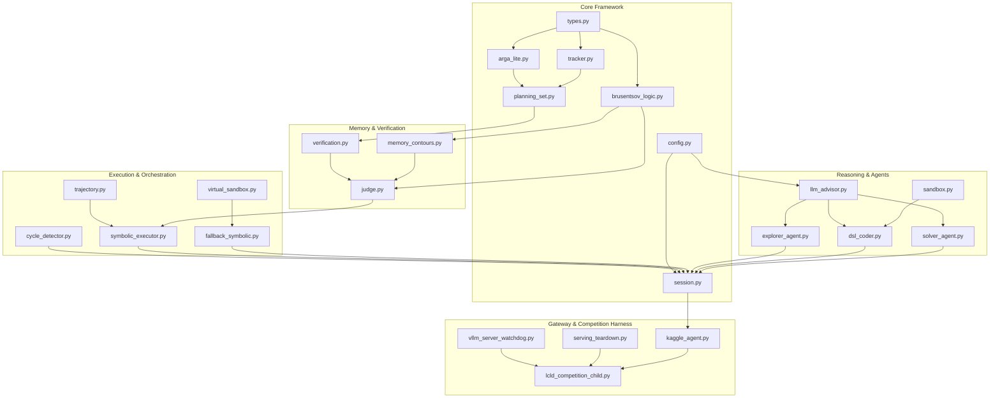

# ARC-AGI-3 LCLD Agent
# Engineering Specification — Version 10.5
# (Exhaustive Implementation Blueprint: Core Source Files, Brusentsov Entailment Operators, Carrollian Nullity Completeness, Two-Tier Action Lifecycle, Reactive DSL Invalidation, Universal Multimodal Dual-View, 5-Block Stratified Memory, Exemplars & Production vLLM Runtime)

---

## 0. Engineering Objective & Implementation Contracts

This document provides the complete, authoritative implementation specification for the **ARC-AGI-3 LCLD Agent (Version 10.5)**. Any software engineer possessing standard Python 3.12 tools must be able to recreate, test, and deploy the entire codebase from scratch using only this document and the accompanying Architectural Specification, without ambiguity or external dependencies.

### 0.1 Key Engineering Contracts

1. **Standard 16-Color Palette ($0..15$) & Semantic Role Mapping**: ARC-AGI-3 operates over a 16-color palette (integers $0..15$). The agent maintains a persistent `PaletteRoleMap` tracking functional roles (`EntityRole`) for each color index, completely replacing destructive `[COLOR]` erasure with role-aware semantic labeling (`Color N (ROLE)`).
2. **Deterministic Perception & Identity Tracking**: ARGA-Lite object extraction, cavity detection, substantive spatial relation filtering ($area \ge 4$), and multi-frame identity tracking via `PersistentObjectTracker`.
3. **Partitioned Action Space & Hardware Ban on `ACTION7`**:
   - Discrete directional/toggle actions: `ACTION1..5`.
   - Spatial coordinate clicks: `ACTION6(x, y)`.
   - Step-reversal (`ACTION7` / `Undo`) is **hardware-blocked** by architectural contract. Epistemic consistency is maintained strictly through forward deterministic planning and clean state resets ($S_0$).
4. **Dual-Space Coordinate Synchronization & 1px Boundary Crop**: Raw environment frames are cropped by 1 border pixel on all 4 sides ($[1:-1, 1:-1]$), producing a local perception grid $(H-2) \times (W-2)$ with `crop_offset = 1`. Dispatched `ACTION6` actions shift local coordinates to engine coordinates (`local_x + crop_offset`, `local_y + crop_offset`). Deduplication in `tested_coords` symmetrically decodes engine coordinates back to local coordinates, preventing redundant probing cycles.
5. **Brusentsov 4-Valued Logic Engine & Carrollian Nullity Completeness**:
   - Mathematical realization of 4-valued judgments (`FOLLOW: +1`, `OMIT: 0`, `NULL: -1`, `UNDECIDED: SEEK`) in `v10_agent/brusentsov_logic.py`.
   - Strict 8-tier decision cascade in `v10_agent/judge.py`, default verdict `Verdict.OMIT`, empty expectation handling ($len(expected)=0 \to \text{IRRELEVANT}$), and ISO-10 candidate non-severance.
   - **Vacuous FOLLOW Prevention (Tier 8)**: Guard against the classical material implication paradox ($x'y \to \text{FOLLOW}$). Certified actions with non-zero delta but empty or unverified expected propositions evaluate strictly to `Verdict.OMIT`, never `FOLLOW`.
   - **Carrollian Nullity Completeness ($xy'_0 \to \text{NULL}$)** in `contradicts()`:
     - *Object Identity*: Expected `preserved`, observed `destroyed` / `vanished` / `missing`.
     - *Physical Stagnation*: Expected motion ($\Delta_{\text{exp}} \neq 0$), observed stationary ($\Delta_{\text{obs}} == 0$).
     - *Unintended Mutation*: Expected stationary/invariant ($\Delta_{\text{exp}} == 0$ or `unchanged`), observed motion ($\Delta_{\text{obs}} \neq 0$).
     - *Direction Inversion*: Expected vector sign opposite to observed vector sign ($\text{sign}(\Delta_{\text{exp}}) \times \text{sign}(\Delta_{\text{obs}}) < 0$).
     - Seamless normalization across tuple kinematics `(dy, dx)`, `moved`, `step_moved`, scalar signs `row_delta`, `col_delta`, and cross-comparisons.
   - **Kinematic Vacuity Guard on $S_0$**: In `evaluate_invariant_across_levels()`, kinematic rules evaluated on the pristine frame without actions taken evaluate strictly to `Ternary.IRRELEVANT`.
6. **5-Block Stratified Memory Architecture**:
   - 1) `PaletteRoleMap`: 16-color palette affordances, dynamic roles, pixel counts, and confidence.
   - 2) `CoreInvariantRegistry`: Symbolic rules (`GroundedInvariant`) grounded in physical exemplars (`NEGATIVE_BARRIER` from Defeat, `POSITIVE_CANON` from Victory).
   - 3) `EpisodicExemplarBuffer`: Concrete physical exemplars of terminal states (`DefeatExemplar` on `GAME_OVER`, `VictoryExemplar` on level victory).
   - 4) `CurriculumProgressionBuffer`: Cross-level trajectory history and distilled domain patterns.
   - 5) `WorkingRolloutMemory`: Active candidate steps, propositions, and transition deltas.
7. **Macro-Step Unrolling & Early Null Severance with Epistemic Recovery**:
   - Macro-commands like `action1(count=N)` are decomposed into $N$ atomic steps via `_decompose_expected_propositions_for_substep`. State invariants (`unchanged`, `preserved`) are assigned to all intermediate substeps, and single-step motion signs (`step_moved: (sgn(dy), sgn(dx))`) are checked at each transition.
   - Legacy `break_on_null` bypasses are completely eliminated. Any step receiving `Verdict.NULL` immediately terminates execution of the candidate (`sever()`), dropping remaining steps and synthesizing a structured diagnostic block (`_build_step_contradiction_diagnostic`).
   - The orchestrator dispatches a clean `RESET` to restore pristine state $S_0$, and records the physical grid diff into `failed_attempts_scratchpad`.
8. **Two-Tier Action Lifecycle & Affordance Completeness**:
   - Primitive probe management (`PrimitiveProbeManager`) distinguishes actions with immediate observable delta from conditional triggers. Actions with $\Delta = 0$ on pristine frame $S_0$ are tracked in `conditional_candidate_actions` and preserved in `available_actions` with affordance `EffectClass.CONDITIONAL_TRIGGER` (`status: unconfirmed_on_s0`) rather than being discarded.
   - Once an action demonstrates an observable delta in any subsequent state, it transitions immediately into `confirmed_effective_actions`.
9. **Reactive DSL Invalidation & Auto-Augmentation**:
   - When any confirmed action missing from the current active manifest is observed during probing, solver execution, or direct fallback, `GameSession` triggers reactive invalidation: `active_module = None`, `active_manifest = None`, `coder_failed_for_level = False`, and `replan_requested = True`.
   - `DSLCoder.generate_dsl` automatically synthesizes canonical sandboxed wrappers (`def actionX(api): ...`) and manifest descriptors for any confirmed actions omitted by the LLM Coder output.
10. **Universal Multimodal Dual-View**:
    - Generates synchronized pairs of PNG frames: `raw_frame.png` (unannotated pristine pixels) and `annotated_frame.png` (bounding boxes, object aliases, centroids).
    - Passed to Explorer, Coder, and Solver agents to eliminate perceptual blindness to multi-color compound objects caused by monochromatic connected-component parsing.
    - Strict Cartesian $(Row, Col) \leftrightarrow (Y, X)$ coordinate disambiguation ($X=\text{column}, Y=\text{row}$).
11. **Clean Physics Simulator & Generalized Aspect Ratio**: Aspect ratio heuristics ($\ge 3.0$) replace puzzle-specific constants. Domain-general topological invariants (`ConnectedComponentConservation`, `GravitySettling`, `ContactTrigger`, `AreaConservation`) model world physics without geometric hardcoding.
12. **Generalized A* Search over Feature Differentials**: Fallback engine operating over centroid displacement, bounding box deltas, color match ratio, and object count deltas (`v10_agent/virtual_sandbox.py`), with perimeter coordinate clamping.
13. **Multi-Trajectory Candidate Pool Traversal via Clean RESET**: Solver plans complete multi-step trajectory packages upfront (up to 4 candidate paths per package); execution is handled deterministically step-by-step by `SymbolicTrajectoryExecutor` with clean environmental resets (`RESET` $\to S_0$) between candidates under a hard limit of 5 attempts per level.
14. **Pristine Frame Invariant Discovery**: Cross-level invariant re-evaluation is deferred to the pristine initial frame of the new level ($S_0$, `level_initial_grid is None`).
15. **VisibleCycle Loop Recovery**: Fast row-level MD5 hashing detecting repeating state-action orbits (periods 1..8, $\ge 2$ repetitions, $\ge 8$ actions) with automatic candidate severance and clean reset (`v10_agent/cycle_detector.py`).
16. **Time Budgeting & Deadline Safety**: Dynamic time tracking with a 15-second reserve; automatic LLM request abort upon reserve breach; socket timeout clamping; and graceful competition child exit (`v10_agent/config.py`, `v10_agent/llm_advisor.py`, `lcld_competition_child.py`).
17. **vLLM Serving Infrastructure**: Strictly validated production flags (`--enable-prefix-caching`, `--enable-chunked-prefill`, `--async-scheduling`, `--no-enable-log-requests`, `--disable-uvicorn-access-log`), non-blocking watchdog (`vllm_server_watchdog.py`), and sub-millisecond socket teardown (`serving_teardown.py`).
18. **AST Code Guardian & Quality Assurance Stack**:
    - `tools/ast_code_guardian.py`: Static AST visitor verifying abstract purity, prohibition of benchmark puzzle IDs, prohibition of heuristic tokens (`piece_steps`, `axis_steps`), and absence of geometric hardcoding.
    - Property-Based Testing with Hypothesis: `test_pbt_brusentsov_axioms.py`, `test_pbt_brusentsov_severance.py`, `test_pbt_scale_invariance.py`, `test_pbt_color_permutation.py`, `test_pbt_coordinate_isomorphism.py`.
    - Unit & Integration Test Suite: 360 tests passing with 100% pass rate.

---

## 1. File Hierarchy & Dependency Graph

The production deployment consists of the following core files and testing suites:

```
c:/arcprize/
├── kaggle_agent.py                             # Competition gateway adapter (ARC_AGI_Agent)
├── submission.py                               # Configuration defaults and canonical enum mappers
├── lcld_competition_child.py                   # Isolated child process runner & game execution loop
├── lcld_preflight.py                           # Structural preflight verification suite
├── phase_a_heavy_smoke.py                      # Offline wheelhouse installer & dynamic vLLM server
├── serving_setup.py                            # Flash-Next compatible serving lifecycle manager
├── serving_teardown.py                         # Sub-millisecond socket probe & process teardown
├── vllm_server_watchdog.py                     # Non-blocking RLock health watchdog daemon
├── build_notebook_v10.py                       # Self-extracting LZMA base64 notebook builder
│
├── tools/
│   └── ast_code_guardian.py                    # Static AST code purity & anti-gaming auditor
│
└── v10_agent/
    ├── __init__.py                             # Package exports and version metadata
    ├── action_adapter.py                       # Native ActionInput and arcade dict converters
    ├── arga_lite.py                            # Deterministic ARGA-Lite perception & relation engine
    ├── brusentsov_logic.py                     # Brusentsov 4-valued Verdict, logic operators & judgments
    ├── config.py                               # V10Config dataclass, deadline tracker & CLI builder
    ├── cycle_detector.py                       # VisibleCycle orbit detector & MD5 grid hasher
    ├── dsl_coder.py                            # Coder Agent (Call 2), AST validator & auto code augmentation
    ├── explorer_agent.py                       # Explorer Agent (Call 1), dual-space coordinate probing & probe manager
    ├── fallback_symbolic.py                    # Deterministic fallback engine wrapping A* search
    ├── frame_media.py                          # Dual-view visualization: raw & annotated PNG renderers
    ├── game_adapter.py                         # Game session interface adapters
    ├── judge.py                                # LayeredVerifier with strict 8-tier decision cascade
    ├── llm_advisor.py                          # LLM client (vLLM OpenAI API, streaming, timeout clamp)
    ├── logging.py                              # Structured JSON audit and session logger
    ├── memory_contours.py                      # 5 memory blocks (PaletteRoleMap, Exemplars, GroundedInvariant, etc.)
    ├── observe.py                              # Observation normalization and 1px border cropping
    ├── planning_set.py                         # Immutable PlanningSet with crop_offset, PlanningObject & Relations
    ├── policy.py                               # Action arbitration policy
    ├── sandbox.py                              # Restricted AST validator & SandboxExecutor
    ├── session.py                              # Master GameSession orchestrator, probing lifecycle & reactive invalidation
    ├── solver_agent.py                         # Solver Agent (Call 3), XML trajectory parser & reflection
    ├── symbolic_executor.py                    # SymbolicTrajectoryExecutor with early severance & diagnostic feedback
    ├── tracker.py                              # PersistentObjectTracker & TrackedObject permanence
    ├── trajectory.py                           # CandidateTrajectory, GroundedStep & TrajectoryPool
    ├── types.py                                # Core types: Grid2D, BoundingBox, Centroid, Propositions
    ├── universal_invariants.py                 # Topological invariants & domain-general discovery
    ├── verification.py                         # VerificationBinder & PropositionSet grounding
    ├── verifier_packet.py                      # Structured symbolic verifier exchange packet
    ├── virtual_sandbox.py                      # Generalized A* search over feature differentials & boundary clamping
    │
    ├── prompt_builders/
    │   ├── __init__.py                         # Prompt builder exports
    │   ├── coder_prompt.py                     # Incremental DSL implementation prompt templates
    │   ├── explorer_prompt.py                  # Probing and coordinate hypothesis templates
    │   └── solver_prompt.py                    # Declarative multi-candidate planning templates (with exemplars & diagnostics)
    │
    └── tests/
        ├── test_pbt_brusentsov_axioms.py       # Hypothesis PBT: Brusentsov logic mathematical axioms
        ├── test_pbt_brusentsov_severance.py    # Hypothesis PBT: Carrollian nullity completeness & early severance
        ├── test_pbt_scale_invariance.py        # Hypothesis PBT: Grid scale invariance (2x2 .. 64x64)
        ├── test_pbt_color_permutation.py       # Hypothesis PBT: 16-color palette invariance
        ├── test_pbt_coordinate_isomorphism.py  # Hypothesis PBT: Dual-space coordinate translation
        ├── test_reactive_dsl_invalidation.py   # Unit test: Two-tier actions, reactive DSL invalidation & augmentation
        ├── test_universal_multimodal_dual_view.py # Unit test: DualView frame rendering & multimodal routing
        ├── test_synthetic_calibration_worlds.py # Synthetic micro-worlds: maze, gravity, contact button
        ├── test_memory_exemplars.py            # DefeatExemplar, VictoryExemplar & GroundedInvariant tests
        └── ...                                 # Comprehensive unit and integration test suite (360 tests)
```

### 1.1 Dependency Graph



---

## 2. Configuration Contract (`v10_agent/config.py`)

All runtime options, budgets, server flags, and deadline thresholds are consolidated in `V10Config`:

```python
@dataclass
class V10Config:
    # LLM Backend & Model Configuration
    llm_advisor_backend: str = "vllm"                      # "vllm" | "fake" | "ollama" | "llama_cli"
    model_path: str = "Qwen/Qwen3.8-27B"
    qwen_model_path: str = "Qwen/Qwen3.8-27B"
    vllm_base_url: str = "http://127.0.0.1:1234/v1"
    qwen_vllm_base_url: str = "http://127.0.0.1:1234/v1"
    vllm_api_key: str = "EMPTY"
    qwen_vllm_api_key: str = "EMPTY"
    context_tokens: int = 131072
    qwen_context_tokens: int = 131072
    max_input_tokens: int = 65536
    qwen_max_input_tokens: int = 65536
    max_output_tokens: int = 32000
    qwen_max_output_tokens: int = 32000
    temperature: float = 1.0
    qwen_temperature: float = 1.0
    solver_temperature: float = 0.7
    coder_temperature: float = 0.5
    explorer_temperature: float = 0.9
    top_p: float = 0.95
    qwen_top_p: float = 0.95
    top_k: int = 20
    qwen_top_k: int = 20
    min_p: float = 0.0
    qwen_min_p: float = 0.0
    presence_penalty: float = 0.0
    qwen_presence_penalty: float = 0.0
    repeat_penalty: float = 1.0
    qwen_repeat_penalty: float = 1.0
    seed: int = 42
    qwen_seed: int = 42
    timeout_seconds: int = 700
    qwen_timeout_seconds: int = 700
    multimodal_enabled: bool = True
    qwen_multimodal_enabled: bool = True
    solver_multimodal_enabled: bool = True
    explorer_multimodal_enabled: bool = True
    coder_multimodal_enabled: bool = True
    enable_thinking: bool = True
    qwen_enable_thinking: bool = True
    reasoning_strength: str = "xhigh"                       # "low" | "medium" | "high" | "xhigh"
    reasoning_budget_tokens: int = 32000
    qwen_reasoning_budget_tokens: int = 32000
    solver_reasoning_budget_tokens: int = 24576
    coder_reasoning_budget_tokens: int = 8192
    explorer_reasoning_budget_tokens: int = 8192
    solver_max_output_tokens: int = 8192
    coder_max_output_tokens: int = 8192
    explorer_max_output_tokens: int = 2048

    # Trajectory & Solver Package Limits
    max_candidates_per_solver_package: int = 4
    max_steps_per_candidate: int = 30
    execute_one_step_at_a_time: bool = True

    # Multi-Token Prediction (MTP=3) Speculative Decoding
    vllm_mtp_enabled: bool = True
    vllm_mtp_tokens: int = 3
    vllm_speculative_method: str = "mtp"
    vllm_speculative_model: str | None = None
    vllm_speculative_config: str | None = None
    vllm_speculative_cli_format: str = "auto"

    # vLLM Server Launch Parameters (Unified Runtime)
    vllm_enable_prefix_caching: bool = True
    vllm_enable_chunked_prefill: bool = True
    vllm_async_scheduling: bool = True
    vllm_no_enable_log_requests: bool = True
    vllm_disable_uvicorn_access_log: bool = True

    # Persistent Object Tracker & 4-Valued Verdict Knobs
    enable_persistent_tracker: bool = True
    track_match_threshold: float = 0.45
    track_max_age: int = 5
    matching_ambiguity_threshold: float = 0.15
    min_reliable_delta: float = 0.8
    track_confidence_threshold: float = 0.6
    occlusion_radius: int = 3
    cumulative_window: int = 3
    track_min_area: int = 1
    enable_undecided_verdict: bool = True
    max_undecided_streak: int = 2
    max_evidence_probes_per_level: int = 3
    min_remaining_actions_for_probe: int = 25

    # Deterministic Sandbox
    sandbox_enabled: bool = True
    sandbox_allowed_modules: list[str] = ["math", "typing", "dataclasses", "enum", "collections"]
    sandbox_max_cpu_seconds: float = 10.0
    sandbox_max_memory_mb: int = 512

    # Deadline Reserve & Time Budgeting
    deadline_reserve_seconds: float = 15.0
    _deadline_time: float | None = None

    # VisibleCycle Loop Recovery
    enable_cycle_detector: bool = True
    cycle_detector_min_actions: int = 8
    cycle_detector_max_period: int = 8
    cycle_detector_min_cycles: int = 2
    cycle_detector_per_level_limit: int = 2

    # Memory Contours & Isolation
    game_memory_reset_on_game_change: bool = True
    game_memory_reset_on_level_change: bool = False
    epistemic_memory_max_entries: int = 50
    syntax_error_memory_max_entries: int = 5
    crop_border_pixels: int = 1

    # Fallback System & Probing Budgets
    enable_symbolic_fallback: bool = True
    coder_exhaustion_forces_fallback: bool = True
    solver_exhaustion_forces_fallback: bool = True
    abort_on_dsl_exhaustion: bool = False
    max_primitive_probes_per_level: int = 16
    enable_primitive_probing: bool = True
    probe_reset_after_discrete: bool = False

    # Competition Ceilings
    max_actions_per_game: int = 500
    max_actions_per_level: int = 80
    max_game_over_resets_per_level: int = 5
    max_chain_attempts_per_level: int = 5
    max_coder_retries_per_level: int = 5
    max_solver_retries_per_level: int = 5
    max_explorer_attempts_per_level: int = 2
    max_explorer_probe_steps: int = 2
    max_invariant_verification_probes: int = 3
    max_invariant_probe_steps: int = 2
    max_explorer_probe_actions_per_level: int = 30
    reset_on_game_over: bool = True
    game_wall_clock_limit_seconds: float = 5000.0
    competition_wall_clock_limit_seconds: float = 30600.0
    concurrency: int = 6
    vllm_max_num_seqs: int = 6
    vllm_startup_timeout_seconds: int = 900
```

---

## 3. Mathematical Logic Engine (`v10_agent/brusentsov_logic.py`)

### 3.1 Mathematical Theory of Brusentsov Entailment

As established by N.P. Brusentsov (2012, *"Усовершенствование логики умозаключений"*):
1. **Aristotelian Entailment**: $Axy \equiv (x = xy)$. Premise $x$ necessarily contains consequence $y$.
2. **Carroll Nullity**: Index «0» denotes incompatibility: $xy'_0$ represents the absolute impossibility of $x$ and $y'$ co-occurring. In Aristotelian universe $\text{УА}$ ($x \neq 0, x' \neq 0$), $(x \Rightarrow y) \equiv xy'_0$.
3. **Three-Valued DNF**:
   $$(x \Rightarrow y) \equiv xy \lor xy'_0 \lor x'y'$$
   where $x'y$ is omitted as **inessential (несущественный)**.
4. **Contrast with Material Implication**:
   $$(x \to y) \equiv (x \Rightarrow y) \lor x'y \equiv x' \lor y$$
   Material implication mistakenly includes $x'y$ as an affirmed truth, causing the paradox of vacuous confirmation.

### 3.2 Verdict and Ternary Enums & Bi-directional Bridge

```python
from enum import Enum
from typing import Any

class Ternary(Enum):
    """Pure Brusentsov ternary truth values for transition verdicts."""
    TRUE = 1          # FOLLOW: Trajectory step confirmed; necessary containment held (xy)
    FALSE = -1        # NULL: Hard physical contradiction; branch severed (xy'0)
    IRRELEVANT = 0    # OMIT: Inessential / passive outcome; branch preserved (x'y or x'y')

    def __eq__(self, other: Any) -> bool:
        if isinstance(other, Verdict):
            return other == self
        return super().__eq__(other)

    def __hash__(self) -> int:
        return super().__hash__()


class EpistemicSignal(Enum):
    """Controller signals. Not truth values."""
    SEEK_EVIDENCE = 1


class Verdict(Enum):
    """Full judge verdict = logical value or epistemic signal."""
    FOLLOW = "FOLLOW"        # maps to Ternary.TRUE
    NULL = "NULL"            # maps to Ternary.FALSE
    OMIT = "OMIT"            # maps to Ternary.IRRELEVANT
    UNDECIDED = "UNDECIDED"  # maps to EpistemicSignal.SEEK_EVIDENCE

    @property
    def ternary(self) -> Ternary | None:
        if self is Verdict.FOLLOW: return Ternary.TRUE
        if self is Verdict.NULL: return Ternary.FALSE
        if self is Verdict.OMIT: return Ternary.IRRELEVANT
        return None

    @classmethod
    def from_ternary(cls, t: Ternary) -> "Verdict":
        if t is Ternary.TRUE: return cls.FOLLOW
        if t is Ternary.FALSE: return cls.NULL
        if t is Ternary.IRRELEVANT: return cls.OMIT
        raise ValueError(f"Cannot map {t} to Verdict")

    def __eq__(self, other: Any) -> bool:
        if isinstance(other, Ternary):
            if self is Verdict.FOLLOW: return other is Ternary.TRUE
            if self is Verdict.NULL: return other is Ternary.FALSE
            if self is Verdict.OMIT: return other is Ternary.IRRELEVANT
            return False
        return super().__eq__(other)

    def __hash__(self) -> int:
        return super().__hash__()
```

### 3.3 Auditable Judgment Structure (`BrusentsovJudgment`)

```python
@dataclass(frozen=True)
class BrusentsovJudgment:
    """Auditable transition evaluation judgment grounded on Brusentsov logic."""
    trajectory_id: str
    step_id: str
    verdict: Verdict | Ternary
    expected_propositions: PropositionSet
    observed_propositions: PropositionSet
    explanation: str = ""
    timestamp: float = field(default_factory=time.time)
    ambiguity_score: float | None = None
    evidence_hint: str | None = None
    matching_candidates: list[str] = field(default_factory=list)
    track_confidence_min: float | None = None
    action_dict: dict[str, Any] = field(default_factory=dict)
    is_effective: bool = False

    @property
    def ternary_verdict(self) -> Verdict | Ternary:
        return self.verdict
```

### 3.4 Propositional Entailment (`implies_brusentsov`)

```python
def implies_brusentsov(expected: PropositionSet, observed: PropositionSet) -> Ternary:
    """Evaluate necessary implication following Brusentsov ternary logic.

    Returns:
      TRUE (1)       : Every expected atomic proposition is necessarily contained in the observed set (xy).
      FALSE (-1)     : Any expected proposition is physically contradicted (incompatibility / nullity, xy'0).
      IRRELEVANT (0) : Expected set is empty or not implied, yet no incompatibility exists (inessential, x'y).
    """
    if len(expected) == 0:
        return Ternary.IRRELEVANT

    # 1. Incompatibility check (NULL / xy'0 check)
    for e in expected:
        for o in observed:
            if contradicts(e, o):
                return Ternary.FALSE

        if e.family == "object_identity" and e.predicate == "preserved":
            is_destroyed = any(
                o.family == "object_identity"
                and (o.subject_id == e.subject_id or not e.subject_id)
                and o.predicate in {"destroyed", "missing", "vanished"}
                for o in observed
            )
            if is_destroyed:
                return Ternary.FALSE

    # 2. Necessary containment check (FOLLOW / xy check)
    if all(is_necessarily_contained(e, observed) for e in expected):
        return Ternary.TRUE

    # 3. Inessential missing effect without physical contradiction (OMIT / x'y check)
    return Ternary.IRRELEVANT
```

### 3.5 Physical Contradiction Detector (`contradicts`) with Carroll Nullity Completeness

```python
def contradicts(expected: AtomicProposition, observed: AtomicProposition) -> bool:
    """Check if an observed proposition physically contradicts an expected proposition (Carrollian nullity xy'_0)."""
    # 0. Subject matching: propositions regarding different distinct entities cannot directly contradict each other
    if expected.subject_id and observed.subject_id and expected.subject_id != observed.subject_id:
        return False

    # 1. Object Identity preservation (Carroll nullity xy'_0 -> NULL):
    if expected.family == "object_identity" and observed.family == "object_identity":
        if expected.subject_id == observed.subject_id or not expected.subject_id:
            if expected.predicate == "preserved" and observed.predicate in ("destroyed", "vanished", "missing"):
                return True
            if expected.predicate in ("destroyed", "vanished", "missing") and observed.predicate == "preserved":
                return True

    # 2. Attribute Delta contradiction:
    if expected.family == "attribute_delta" and observed.family == "attribute_delta":
        if (expected.subject_id == observed.subject_id or not expected.subject_id) and expected.predicate == observed.predicate:
            if expected.value is not None and observed.value is not None:
                if _normalize_value(expected.value) != _normalize_value(observed.value):
                    return True

    # 3. Kinematic motion & Invariant Nullity (Stagnation, Unintended Mutation, Inversion)
    exp_p = expected.predicate.lower()
    obs_p = observed.predicate.lower()
    subj_matches = (expected.subject_id == observed.subject_id or not expected.subject_id)

    # 3a. Tuple-based kinematics: ("moved", "step_moved")
    if subj_matches and exp_p in ("moved", "step_moved") and obs_p in ("moved", "step_moved"):
        exp_vec = _unpack_dy_dx(expected.value)
        obs_vec = _unpack_dy_dx(observed.value)
        if exp_vec is not None and obs_vec is not None:
            exp_dy, exp_dx = exp_vec
            obs_dy, obs_dx = obs_vec
            # 1. Stagnation: expected motion on an axis, but observed stationary (0)
            if (exp_dy != 0 and obs_dy == 0) or (exp_dx != 0 and obs_dx == 0):
                return True
            # 2. Unintended Mutation: expected 0 on an axis, but observed motion
            if (exp_dy == 0 and obs_dy != 0) or (exp_dx == 0 and obs_dx != 0):
                return True
            # 3. Direction Inversion
            if (exp_dy * obs_dy < 0) or (exp_dx * obs_dx < 0):
                return True

    # 3b. Invariant violation: expected unchanged / stationary, but observed motion
    if subj_matches and exp_p in ("unchanged", "stationary"):
        if obs_p in ("moved", "step_moved"):
            obs_vec = _unpack_dy_dx(observed.value)
            if obs_vec is not None and (obs_vec[0] != 0 or obs_vec[1] != 0):
                return True
        elif obs_p in ("row_delta", "delta_r", "dy", "col_delta", "delta_c", "dx"):
            try:
                if int(observed.value) != 0:
                    return True
            except (ValueError, TypeError):
                pass

    # 3c. Scalar metric sign contradictions (dy / dx / row_delta / col_delta)
    if expected.family == "metric_sign" and observed.family == "metric_sign" and subj_matches:
        is_row = exp_p in ("row_delta", "delta_r", "dy") and obs_p in ("row_delta", "delta_r", "dy")
        is_col = exp_p in ("col_delta", "delta_c", "dx") and obs_p in ("col_delta", "delta_c", "dx")
        if is_row or is_col:
            if expected.secondary_id == observed.secondary_id:
                try:
                    exp_sign = int(expected.value)
                    obs_sign = int(observed.value)
                    if exp_sign != 0 and obs_sign == 0:
                        return True
                    if exp_sign == 0 and obs_sign != 0:
                        return True
                    if exp_sign * obs_sign < 0:
                        return True
                except (ValueError, TypeError):
                    pass

    # 3d. Cross-check: tuple expected vs scalar observed
    if subj_matches and exp_p in ("moved", "step_moved") and observed.family == "metric_sign":
        exp_vec = _unpack_dy_dx(expected.value)
        if exp_vec is not None:
            exp_dy, exp_dx = exp_vec
            if obs_p in ("row_delta", "delta_r", "dy"):
                try:
                    obs_dy = int(observed.value)
                    if (exp_dy != 0 and obs_dy == 0) or (exp_dy == 0 and obs_dy != 0) or (exp_dy * obs_dy < 0):
                        return True
                except (ValueError, TypeError):
                    pass
            elif obs_p in ("col_delta", "delta_c", "dx"):
                try:
                    obs_dx = int(observed.value)
                    if (exp_dx != 0 and obs_dx == 0) or (exp_dx == 0 and obs_dx != 0) or (exp_dx * obs_dx < 0):
                        return True
                except (ValueError, TypeError):
                    pass

    # 3e. Cross-check: scalar expected vs tuple observed
    if subj_matches and expected.family == "metric_sign" and obs_p in ("moved", "step_moved"):
        obs_vec = _unpack_dy_dx(observed.value)
        if obs_vec is not None:
            obs_dy, obs_dx = obs_vec
            if exp_p in ("row_delta", "delta_r", "dy"):
                try:
                    exp_dy = int(expected.value)
                    if (exp_dy != 0 and obs_dy == 0) or (exp_dy == 0 and obs_dy != 0) or (exp_dy * obs_dy < 0):
                        return True
                except (ValueError, TypeError):
                    pass
            elif exp_p in ("col_delta", "delta_c", "dx"):
                try:
                    exp_dx = int(expected.value)
                    if (exp_dx != 0 and obs_dx == 0) or (exp_dx == 0 and obs_dx != 0) or (exp_dx * obs_dx < 0):
                        return True
                except (ValueError, TypeError):
                    pass

    # 4. Relation Existence contradiction
    if expected.family == "relation_existence" and observed.family == "relation_existence":
        if (expected.subject_id == observed.subject_id and expected.secondary_id == observed.secondary_id and expected.predicate == observed.predicate):
            if expected.value is not None and observed.value is not None:
                if bool(expected.value) != bool(observed.value):
                    return True

    # 5. Terminal Metadata contradiction
    if expected.family == "terminal_metadata" and observed.family == "terminal_metadata":
        if expected.predicate == "win" and observed.predicate in {"game_over", "lost"}:
            return True

    # 6. Spatial Position contradiction
    if expected.family == "spatial_position" and observed.family == "spatial_position":
        if expected.subject_id == observed.subject_id and expected.value != observed.value:
            return True

    # 7. Area Conservation contradiction
    if expected.family == "area_conservation" and observed.family == "area_conservation":
        if expected.subject_id == observed.subject_id and expected.value != observed.value:
            return True

    return False
```

### 3.6 Kinematic Vacuity Guard on Pristine Frame $S_0$

In `evaluate_invariant_across_levels()`:
```python
# Guard: On pristine frame S0 (no actions taken), kinematic invariants
# cannot be empirically confirmed or falsified. Return IRRELEVANT.
if not act_id:
    return Ternary.IRRELEVANT
```

---

## 4. Perception & Dual-Space Coordinate Grounding

### 4.1 ARGA-Lite Perception (`v10_agent/arga_lite.py`)

1. **Connected Component Extraction**: Scans 2D grid ($H \times W$) using 4-connectivity or 8-connectivity. Extracts contiguous monochrome components with properties:
   - `color`: Integer in $[0..15]$ (16-color palette).
   - `pixels`: Set of coordinate tuples `(r, c)`.
   - `bounding_box`: `(min_r, min_c, max_r, max_c)`.
   - `centroid`: `((min_r + max_r) / 2.0, (min_c + max_c) / 2.0)`.
   - `area`: Number of pixels.
2. **Cavity Detection**: Identifies background regions enclosed within component boundaries.
3. **Substantive Filtering**: Components with $\text{area} < 4$ are classified as decorative markers or noise and excluded from the primary relation graph.

### 4.2 Multi-Frame Identity Tracking (`v10_agent/tracker.py`)

Bipartite cost function between active track $T$ and detected component $C$:
```python
color_diff = 0.0 if track.color == comp.color else 1.0
centroid_dist = (abs(track.centroid.row - comp.centroid.row) + abs(track.centroid.col - comp.centroid.col)) / max(grid_dim, 1)
shape_jaccard = jaccard_similarity(track.shape_signature_stable, comp.shape_signature, track.mask, comp.mask)
area_rel_diff = abs(track.area - comp.area) / max(track.area, comp.area, 1)

cost = (
    0.30 * color_diff
    + 0.40 * centroid_dist
    + 0.20 * (1.0 - shape_jaccard)
    + 0.10 * area_rel_diff
)
```
- Match accepted if `cost < track_match_threshold` (0.45).
- If difference between best and second-best match cost is $< 0.15$, flags ambiguity, inducing `Verdict.UNDECIDED`.

### 4.3 Dual-Space Coordinate Resolution Contract

1. **Perception Frame (`crop_border_pixels = 1`)**:
   - ARGA-Lite crops 1 border pixel on all 4 sides ($[1:-1, 1:-1]$), operating on local dimensions $H-2, W-2$ (`crop_offset = 1`).
   - Coordinate candidates in `PlanningSet` operate strictly in local bounds $[0, W_{\text{local}}) \times [0, H_{\text{local}})$.
2. **Action Dispatch Translation**:
   - Emitting `ACTION6` to the arcade gateway shifts coordinates to engine space:
     ```python
     engine_x = int(local_x) + self.crop_offset
     engine_y = int(local_y) + self.crop_offset
     action_dict["data"] = {
         "x": engine_x,
         "y": engine_y,
         "local_x": int(local_x),
         "local_y": int(local_y),
         "crop_offset": self.crop_offset,
     }
     ```
3. **Tested Coordinate Deduplication**:
   - Deduplication reconstructs local coordinates symmetrically:
     ```python
     rec_crop = p.action_data.get("crop_offset", eff_crop)
     tested_coords.add((int(x) - rec_crop, int(y) - rec_crop))
     ```
   - Prevents redundant probing cycles.

### 4.4 Universal Multimodal Dual-View & Coordinate Disambiguation (`frame_media.py`)

1. **Dual-View Rendering**:
   - `render_grid_png(grid)`: Generates unannotated raw pixel frame preserving pristine visual context.
   - `render_annotated_frame_png(grid, planning_set)`: Overlays colored bounding boxes, alias labels (`A`, `B`, `C`...), and centroids onto the image.
   - Both frames are passed as `[image 1: raw pixels]` and `[image 2: annotated, alias boxes]` to Explorer, Coder, and Solver prompts.
2. **Cartesian Coordinate Disambiguation**:
   - Prompts and diagnostics strictly enforce Cartesian conventions:
     - `x` is horizontal (column index, $0 \le x < W$).
     - `y` is vertical (row index, $0 \le y < H$).
     - Tuples are explicitly labeled `(Row, Col)` or `(x, y)` to eliminate axis transposition.

---

## 5. Stratified 5-Block Memory Architecture (`v10_agent/memory_contours.py`)

### 5.1 16-Color Palette & Role Mapping

```python
class EntityRole(str, Enum):
    """Semantic functional role of a color in the game grid (palette 0..15)."""
    BACKGROUND = "background"     # Empty / filler cells
    ACTOR = "actor"               # Controllable object (moves with ACTION1..5 or clicks)
    OBSTACLE = "obstacle"         # Impassable walls (zero delta on collision)
    HAZARD = "hazard"             # Lethal color (contact triggers RESET / defeat)
    TARGET = "target"             # Goal zone / exit (contact triggers VICTORY)
    COLLECTIBLE = "collectible"   # Items that vanish on contact (keys, coins)
    PORTAL = "portal"             # Teleports or state-change triggers
    UNKNOWN = "unknown"           # Not yet classified


@dataclass
class ColorAffordance:
    """Affordance record for a single color index (0..15) in the ARC-AGI-3 palette."""
    color_id: int                          # 0..15
    role: EntityRole = EntityRole.UNKNOWN
    is_dynamic: bool = False               # Does this color move or change?
    pixel_count: int = 0                   # Current count of pixels with this color
    interaction_count: int = 0             # Number of agent interactions observed
    confidence: float = 0.0                # Confidence in role assignment (0.0 .. 1.0)
    evidence: list[str] = field(default_factory=list)

    def to_dict(self) -> dict[str, Any]:
        return {
            "color_id": self.color_id,
            "role": self.role.value,
            "is_dynamic": self.is_dynamic,
            "pixel_count": self.pixel_count,
            "interaction_count": self.interaction_count,
            "confidence": round(self.confidence, 2),
            "evidence": list(self.evidence),
        }


@dataclass
class PaletteRoleMap:
    """Semantic mapping of all 16 ARC-AGI-3 colors (0..15) to functional roles.
    Replaces destructive color erasure ([COLOR]) with role-aware generalization.
    """
    colors: list[ColorAffordance] = field(default_factory=lambda: [
        ColorAffordance(color_id=i) for i in range(16)
    ])

    def get(self, color_id: int) -> ColorAffordance:
        if 0 <= color_id < len(self.colors):
            return self.colors[color_id]
        return ColorAffordance(color_id=color_id)

    def assign_role(self, color_id: int, role: EntityRole, confidence: float = 0.5, evidence: str = "") -> None:
        if 0 <= color_id < len(self.colors):
            aff = self.colors[color_id]
            if confidence >= aff.confidence or aff.role == EntityRole.UNKNOWN:
                aff.role = role
                aff.confidence = max(aff.confidence, confidence)
                if evidence:
                    aff.evidence.append(evidence)

    def get_role_label(self, color_id: int) -> str:
        if 0 <= color_id < len(self.colors):
            aff = self.colors[color_id]
            return f"Color {color_id} ({aff.role.value.upper()})"
        return f"Color {color_id} (UNKNOWN)"

    def generalize_color_reference(self, text: str) -> str:
        """Replace color IDs with role-aware labels instead of destructive [COLOR] erasure."""
        def _replace_color(m: re.Match) -> str:
            try:
                cid = int(m.group(1))
                return self.get_role_label(cid)
            except (ValueError, IndexError):
                return m.group(0)

        text = re.sub(r"\bcolor\s+(\d+)\b", _replace_color, text, flags=re.IGNORECASE)
        text = re.sub(r"\bcolor_(\d+)\b", _replace_color, text, flags=re.IGNORECASE)
        return text
```

### 5.2 Defeat and Victory Exemplars

```python
@dataclass
class DefeatExemplar:
    """Concrete example of a fatal error — grounding for NEGATIVE_BARRIER invariants (xy'_0 -> NULL)."""
    level_index: int
    fatal_step: int
    fatal_action_id: int                         # 1..6
    fatal_coords: tuple[int, int] | None = None  # (x, y) for ACTION6
    actor_position_before: tuple[int, int] = (0, 0)
    hazard_color: int = -1                       # Color 0..15
    pre_defeat_subgrid: list[list[int]] = field(default_factory=list)
    environment_signal: str = ""
    explanation: str = ""
    timestamp: float = field(default_factory=time.time)

    def format_for_prompt(self) -> str:
        coord_str = f" at coords ({self.fatal_coords[0]}, {self.fatal_coords[1]})" if self.fatal_coords else ""
        return (
            f"LAST DEFEAT (Level {self.level_index}, Step {self.fatal_step}):\n"
            f"  Action: ACTION{self.fatal_action_id}{coord_str}\n"
            f"  Actor was at: row={self.actor_position_before[0]}, col={self.actor_position_before[1]}\n"
            f"  Hazard color: {self.hazard_color}\n"
            f"  Signal: {self.environment_signal}\n"
            f"  Lesson: {self.explanation}"
        )


@dataclass
class VictoryExemplar:
    """Concrete example of level completion — grounding for POSITIVE_CANON invariants (xy -> FOLLOW)."""
    level_index: int
    total_steps: int
    action_sequence: list[int] = field(default_factory=list)
    key_transitions: list[dict[str, Any]] = field(default_factory=list)
    final_action_id: int = 0
    target_color: int = -1                      # Color 0..15
    final_subgrid: list[list[int]] = field(default_factory=list)
    explanation: str = ""
    winning_invariants_used: list[str] = field(default_factory=list)
    timestamp: float = field(default_factory=time.time)

    def format_for_prompt(self) -> str:
        seq_str = " -> ".join(str(a) for a in self.action_sequence[:20])
        if len(self.action_sequence) > 20:
            seq_str += "..."
        lines = [
            f"LAST VICTORY (Level {self.level_index}, {self.total_steps} steps):",
            f"  Winning sequence: [{seq_str}]",
            f"  Final action: ACTION{self.final_action_id} -> reached Color {self.target_color} (TARGET)",
        ]
        if self.key_transitions:
            lines.append("  Key breakthroughs:")
            for kt in self.key_transitions[:5]:
                lines.append(f"    - Step {kt.get('step', '?')}: {kt.get('description', 'transition')}")
        lines.append(f"  Explanation: {self.explanation}")
        return "\n".join(lines)


@dataclass
class GroundedInvariant:
    """Symbolic invariant grounded in concrete exemplars via Brusentsov logic of entailment."""
    invariant_id: str
    antecedent: str               # e.g., 'Contact(ACTOR, Color_2)'
    consequent: str               # e.g., 'DefeatReset()'
    brusentsov_type: str          # 'NEGATIVE_BARRIER' or 'POSITIVE_CANON'
    scope: str                    # 'CORE_GAME_LAW' or 'LEVEL_SPECIFIC'
    grounded_in_defeat: DefeatExemplar | None = None
    grounded_in_victory: VictoryExemplar | None = None
    times_confirmed: int = 0
    times_falsified: int = 0
    confidence: float = 0.5
    created_on_level: int = 0

    def is_active(self) -> bool:
        return self.times_falsified == 0
```

### 5.3 GameMemory: Consolidated 5-Store Architecture

```python
@dataclass
class GameMemory:
    """Cross-level memory summary surviving level transitions within the same game."""
    game_id: str
    confirmed_action_effects: dict[str, str] = field(default_factory=dict)
    unconfirmed_actions: dict[str, str] = field(default_factory=dict)
    selection_mechanics: list[str] = field(default_factory=list)
    reusable_primitives: list[dict[str, Any]] = field(default_factory=list)
    invariant_rules: list[str] = field(default_factory=list)
    tier1_kinematics_and_topology: list[str] = field(default_factory=list)
    tier2_interactions: list[str] = field(default_factory=list)
    tier3_level_rules: list[str] = field(default_factory=list)
    level_solution_patterns: list[dict[str, Any]] = field(default_factory=list)
    completed_levels: int = 0
    structured_invariants: list[StructuredInvariant] = field(default_factory=list)
    confirmed_actor_ids: set[str] = field(default_factory=set)

    # --- 5 Functional Memory Blocks ---
    palette: PaletteRoleMap = field(default_factory=PaletteRoleMap)
    last_defeat_exemplar: DefeatExemplar | None = None
    last_victory_exemplar_v2: VictoryExemplar | None = None
    grounded_invariants: list[GroundedInvariant] = field(default_factory=list)
    curriculum_history: list[dict[str, Any]] = field(default_factory=list)
    working_hypotheses: list[dict[str, Any]] = field(default_factory=list)
```

---

## 6. Universal Invariants & Generalized Fallback

### 6.1 Domain-General Topological Invariants (`v10_agent/universal_invariants.py`)

Aspect ratio $\ge 3.0$ replaces heuristic dimensions:
```python
@dataclass(frozen=True)
class ConnectedComponentConservation:
    subject_id: str
    component_count: int = 1
    area: int = 1
    confidence: float = 0.95

@dataclass(frozen=True)
class GravitySettling:
    subject_id: str
    direction: tuple[int, int]
    support_id: str | None = None
    confidence: float = 0.85

@dataclass(frozen=True)
class ContactTrigger:
    subject_id: str
    trigger_id: str
    consequence: str
    confidence: float = 0.85

@dataclass(frozen=True)
class AreaConservation:
    subject_id: str
    area: int
    confidence: float = 0.95
```

### 6.2 Generalized A* Search over Feature Differentials (`v10_agent/virtual_sandbox.py`)

Normalized 4-part geometric distance:
$$h(S) = 0.4 \cdot \Delta_{\text{centroid}} + 0.2 \cdot \Delta_{\text{bbox}} + 0.2 \cdot (1.0 - \text{color\_match}) + 0.2 \cdot \Delta_{\text{count}}$$
Perimeter coordinate clamping prevents spurious boundary exceptions:
$$y \leftarrow \max(0, \min(H-1, y)), \quad x \leftarrow \max(0, \min(W-1, x))$$

---

## 7. Verification & Judge Cascade (`v10_agent/judge.py`)

### 7.1 Strict 8-Tier Decision Cascade

```
Tier 1: Terminal Win Condition (WIN / levels_completed increase) ───────────> FOLLOW
Tier 2: Terminal Loss Condition (GAME_OVER / LOST) ─────────────────────────> NULL
Tier 3: Zero Grid Delta on Confirmed Motion Action:
        - Wall / obstacle collision in invariant rules? ────────────────────> OMIT (Soft Stop)
        - Otherwise unexpected zero delta? ─────────────────────────────────> NULL (Contradiction)
Tier 4: Epistemic Uncertainty & Multi-Frame Tracking Ambiguity:
        - Upstream GroundedStep confidence == 'low' / ambiguous status ─────> UNDECIDED
        - Ambiguity diff < matching_ambiguity_threshold (0.15) ─────────────> UNDECIDED
        - Participating TrackedObject confidence < threshold (0.60) ────────> UNDECIDED
Tier 5: Explicit EXPECT Contradiction (implies_brusentsov == FALSE) ─────────> NULL
Tier 6: Explicit EXPECT Necessary Containment (implies_brusentsov == TRUE) ──> FOLLOW
Tier 7: Unconfirmed Zero Delta or Low Metric Delta:
        - Zero Delta on Unconfirmed Action with non-empty EXPECT ───────────> UNDECIDED
        - Low Metric Delta: 0 < max displacement < min_reliable_delta (0.8) ─> UNDECIDED
Tier 8: Action Effect Verification & Default (Elimination of Vacuous Follow):
        - Non-zero delta + len(expected) > 0 + prop_verdict == TRUE ────────> FOLLOW
        - Non-zero delta + empty / unverified expected propositions ─────────> OMIT (Brusentsov x'y)
        - Default Fallback (Fail-Safe Preservation, ISO-10) ───────────────────> OMIT
```

### 7.2 Tier 3 Implementation: Wall Collision Soft Stop

```python
# Tier 3: Zero Grid Delta on Confirmed Motion Action
if zero_delta and is_confirmed_motion and act_id not in ("ACTION5", "ACTION6", "RESET"):
    is_boundary_collision = False
    if game_memory is not None:
        inv_rules = getattr(game_memory, "invariant_rules", [])
        is_boundary_collision = any(
            re.search(r"\b(?:wall|blocked|boundary|obstacle|barrier|collision|impassable)\b", r, re.IGNORECASE)
            for r in inv_rules
        )
    if is_boundary_collision:
        return BrusentsovJudgment(
            trajectory_id=step.step_id,
            step_id=step.step_id,
            verdict=Verdict.OMIT,
            expected_propositions=step.expected_propositions,
            observed_propositions=observed,
            explanation=f"Step {step.step_id} ({step.dsl_function} / {act_id}): Motion produced zero delta against wall/obstacle. Soft stop — Brusentsov omit x'y.",
            action_dict=act_dict,
            is_effective=False,
        )
    return BrusentsovJudgment(
        trajectory_id=step.step_id,
        step_id=step.step_id,
        verdict=Verdict.NULL,
        expected_propositions=step.expected_propositions,
        observed_propositions=observed,
        explanation=f"Step {step.step_id} ({step.dsl_function} / {act_id}): Motion produced zero delta. Brusentsov nullity xy'_0.",
        action_dict=act_dict,
        is_effective=False,
    )
```

### 7.3 Tier 8 Implementation: Vacuous FOLLOW Elimination

```python
# Tier 8: Positive certificate from GameMemory (verified by non-zero delta)
# Guard against material implication paradox: empty/unverified expected propositions
# with non-zero delta must NOT produce FOLLOW (Brusentsov: x'y -> OMIT, not FOLLOW).
if act_id and confirmed_eff:
    if not zero_delta:
        if len(step.expected_propositions) > 0 and prop_verdict == Ternary.TRUE:
            return BrusentsovJudgment(
                trajectory_id=step.step_id,
                step_id=step.step_id,
                verdict=Verdict.FOLLOW,
                expected_propositions=step.expected_propositions,
                observed_propositions=observed,
                explanation=f"Step {step.step_id} ({step.dsl_function} / {act_id}): Certified action verified with confirmed propositions. Brusentsov follow xy.",
                action_dict=act_dict,
                is_effective=True,
            )
        else:
            return BrusentsovJudgment(
                trajectory_id=step.step_id,
                step_id=step.step_id,
                verdict=Verdict.OMIT,
                expected_propositions=step.expected_propositions,
                observed_propositions=observed,
                explanation=(
                    f"Step {step.step_id} ({step.dsl_function} / {act_id}): Certified action produced non-zero delta "
                    f"but expected propositions {'empty' if len(step.expected_propositions) == 0 else 'unverified'}. "
                    f"Brusentsov omit x'y' (no vacuous confirmation)."
                ),
                action_dict=act_dict,
                is_effective=is_effective,
            )
```

---

## 8. Execution Engine & Session Orchestration

### 8.1 Macro-Step Decomposition & Early Null Severance (`v10_agent/symbolic_executor.py`)

```python
elif judgment.verdict == Ternary.FALSE:
    # Standard NULL: Sever branch & trigger candidate reset immediately
    if active_cand is not None:
        active_cand.sever()
        full_sig = format_sequence_signature(active_cand.steps)
        seq_sig = format_sequence_signature(active_cand.steps[:active_cand.cursor + 1])
        full_tuple = get_trajectory_signature_tuple(active_cand.steps)
        seq_tuple = get_trajectory_signature_tuple(active_cand.steps[:active_cand.cursor + 1])
        epistemic_memory.sever_branch(full_sig)
        epistemic_memory.sever_branch(seq_sig)
        if hasattr(epistemic_memory, "record_failed_completed_trajectory"):
            epistemic_memory.record_failed_completed_trajectory(full_tuple)
            epistemic_memory.record_failed_completed_trajectory(seq_tuple)
    else:
        epistemic_memory.sever_branch(pending_step.step_id)
    cand_advanced = False
    cand_severed = True
    cand_finished = True
    logger.info(
        f"SymbolicExecutor: Step {pending_step.step_id} verified FALSE (NULL contradiction): {judgment.explanation}. "
        f"Candidate severed."
    )
```

### 8.2 Master Dispatch: `act(raw_observation)` in `v10_agent/session.py`

```python
def act(self, raw_observation: Mapping[str, Any]) -> dict[str, Any]:
    if raw_observation.get("game_id") != self.current_game_id:
        self.handle_game_transition(raw_observation.get("game_id"))

    norm_obs = normalize_observation(raw_observation, crop_border=self.config.crop_border_pixels)
    snapshot = extract_arga_snapshot(norm_obs["grid"])
    available_actions = raw_observation.get("available_actions", ["ACTION1", "ACTION2", "ACTION3", "ACTION4", "ACTION5", "ACTION6", "RESET"])
    planning_set = build_planning_set(snapshot, available_actions, crop_offset=self.crop_offset)

    # Pristine frame cross-level invariant evaluation
    if self.pending_cross_level_re_evaluation and self.level_initial_grid is None:
        self._re_evaluate_invariants_on_pristine_frame(snapshot)
        self.pending_cross_level_re_evaluation = False

    if self.solver_reset_pending:
        self.solver_reset_pending = False
        return self._emit_reset(reason=self.solver_reset_reason)

    # Evidence-Seeking Loop Blocking Dispatch
    if self.evidence_seeking_active:
        if self.probe_queue:
            probe_act = self.probe_queue.pop(0)
            return self._emit_action(probe_act)
        self.evidence_seeking_active = False
        self.undecided_streak = 0
        self.pending_step_snapshot = None
        if self.active_pool and self.active_pool.active_candidate():
            self.active_pool.active_candidate().sever(reason="evidence_probe_budget_exhausted")
        self.solver_reset_pending = True
        self.solver_reset_reason = "evidence_probe_exhausted_fallback_null"
        return self._emit_reset(reason="evidence_probe_exhausted_fallback_null")

    if self.in_persistent_fallback:
        return self._execute_fallback_step(snapshot)

    # Primitive Probing Phase (Two-Tier Action Lifecycle)
    if self.probing_phase:
        if not self.probe_queue and not self.probing_initialized:
            discrete_probes = self.probe_manager.plan_discrete_probes(
                planning_set, memory=self.env_spec_memory, max_probes=self.config.max_primitive_probes_per_level,
                known_actions=self.known_actions,
            )
            self.probe_queue.extend(discrete_probes)
            coord_probes = self.explorer.propose_coordinate_probes(
                planning_set, memory=self.env_spec_memory, crop_offset=self.crop_offset
            )
            self.probe_queue.extend(coord_probes)
            self.probing_initialized = True

        if self.probe_queue:
            probe_item = self.probe_queue.pop(0)
            return self._emit_probe(probe_item)
        return self._conclude_probing_and_reset_to_pristine(snapshot)

    # Coder Phase (With Auto-Augmentation)
    if self.active_module is None and not self.coder_failed_for_level:
        manifest = self._synthesize_dsl_module(snapshot, planning_set)
        if manifest is None:
            self.transition_to(SessionPhase.FALLBACK, "Coder exhausted retries")

    # Solver Phase (With Trajectory Pool Replanning)
    if self.active_module is not None and (self.active_pool is None or self.active_pool.active_candidate() is None):
        if self.replan_requested:
            self.active_pool = None
            self.replan_requested = False
        pkg = self.solver.generate_trajectory_package(self.active_manifest, planning_set)
        if pkg:
            self.active_pool = TrajectoryPool.from_package(pkg)
            self.transition_to(SessionPhase.EXECUTING, "Trajectory package loaded")
        else:
            self.transition_to(SessionPhase.FALLBACK, "Solver exhausted retries")

    # Symbolic Step Execution
    if self.current_phase == SessionPhase.EXECUTING and self.active_pool:
        return self._execute_active_candidate_step(snapshot, planning_set)

    return self._emit_fallback_action()
```

### 8.3 Reactive DSL Invalidation Routine (`session.py`)

```python
def _check_and_invalidate_dsl_for_new_action(self, action_id: str, effect_desc: str = "") -> bool:
    """Check if action_id is a confirmed action missing from active_manifest, and invalidate DSL if so."""
    if not action_id or str(action_id).upper() in ("RESET", "ACTION7"):
        return False
    act_up = str(action_id).upper()
    active_fns: set[str] = set()
    if self.active_manifest and isinstance(self.active_manifest, dict):
        for fn in self.active_manifest.get("functions", []):
            if isinstance(fn, dict):
                if fn.get("name"):
                    active_fns.add(str(fn["name"]).upper())
                if fn.get("action_id"):
                    active_fns.add(str(fn["action_id"]).upper())
    is_new_confirmed_action = act_up not in active_fns
    if self.active_module is not None and is_new_confirmed_action:
        logger.info(
            f"Session: New confirmed action {act_up} discovered with effect '{effect_desc}'; "
            f"invalidating active DSL module for re-synthesis."
        )
        self.active_module = None
        self.active_manifest = None
        self.coder_failed_for_level = False
        self.replan_requested = True
        return True
    return False
```

---

## 9. Reliability & Production Infrastructure

### 9.1 VisibleCycle Orbit Detector (`v10_agent/cycle_detector.py`)

Detects state-action orbits of length $1 \le P \le 8$ repeating $\ge 4$ times:
```python
def _hash_grid(grid: Any) -> str:
    """Fast deterministic MD5 row-encoding hash."""
    if grid is None: return "none"
    if isinstance(grid, str): return grid
    try:
        flat = ";".join("".join(str(c) for c in row) for row in grid)
        return hashlib.md5(flat.encode("ascii")).hexdigest()[:16]
    except Exception:
        return str(hash(str(grid)))
```

### 9.2 VLLMAdvisor Timeout Clamping & Deadline Abort (`v10_agent/llm_advisor.py`)

```python
if hasattr(config, "is_deadline_exceeded") and config.is_deadline_exceeded():
    logger.warning("VLLMAdvisor: Deadline reserve breached; aborting request immediately.")
    return "{}"

base_timeout = getattr(config, "timeout_seconds", 700)
rem = config.remaining_time_seconds()
if rem is not None:
    available = max(2.0, rem - getattr(config, "deadline_reserve_seconds", 15.0))
    timeout = min(float(base_timeout), available)
else:
    timeout = float(base_timeout)
```

### 9.3 Sub-Millisecond Serving Teardown (`serving_teardown.py`)

```python
def is_port_open(port: int, host: str = "127.0.0.1", timeout: float = 0.05) -> bool:
    with socket.socket(socket.AF_INET, socket.SOCK_STREAM) as s:
        s.settimeout(timeout)
        return s.connect_ex((host, port)) == 0
```

### 9.4 LZMA Base64 Notebook Packager (`build_notebook_v10.py`)

Packages all runtime files into a self-extracting LZMA base64 archive within a 5-cell Kaggle notebook under 985 KB (current build: ~251 KB).

---

## 10. Code Quality Assurance & Testing Suite

### 10.1 AST Code Guardian (`tools/ast_code_guardian.py`)

```python
# Patterns of known benchmark game IDs that must NEVER be hardcoded in the agent
FORBIDDEN_GAME_PATTERNS = [
    re.compile(r"\b(?:ar|ft|ls|re|gt|nb|pb|rs)\d{2}\b", re.IGNORECASE),
]

# Patterns of game-specific heuristic tokens
FORBIDDEN_HEURISTIC_PATTERNS = [
    re.compile(r"\bpiece_steps\b", re.IGNORECASE),
    re.compile(r"\baxis_steps\b", re.IGNORECASE),
    re.compile(r"internal dots moved from", re.IGNORECASE),
]
```
The auditor walks the abstract syntax tree of all Python files in `v10_agent/` (103 files) and flags:
- Any occurrence of benchmark game identifiers.
- Any heuristic token from legacy implementations.
- Any hardcoded dimension comparisons (`width <= 4`, `height >= 10`).
- Any unapproved generation of `ACTION7`.

### 10.2 Property-Based Testing Suite with Hypothesis

1. `test_pbt_brusentsov_axioms.py`:
   - Empty expected propositions always yield `Ternary.IRRELEVANT` (Ex falso quodlibet elimination).
   - Expected `preserved` vs observed `destroyed` always contradicts (Carroll nullity $xy'_0$).
   - Exact containment always yields `Ternary.TRUE` (Identity consequence $xy$).
   - Unasserted changes never yield `Ternary.TRUE` (Non-vacuous truth).
2. `test_pbt_brusentsov_severance.py`:
   - Verifies physical stagnation, unintended mutation, direction inversion, consistent containment, macro-step decomposition, and early candidate severance.
3. `test_pbt_scale_invariance.py`:
   - ARGA-Lite connected component extraction operates invariantly across randomized grid dimensions ($2 \times 2$ to $64 \times 64$).
4. `test_pbt_color_permutation.py`:
   - Palette affordance tracking and role assignments are invariant under arbitrary permutations of the 16 colors.
5. `test_pbt_coordinate_isomorphism.py`:
   - Coordinate conversions between local perception space and engine space are strictly isomorphic and deduplicated.
6. `test_reactive_dsl_invalidation.py`:
   - Verifies two-tier action preservation (`CONDITIONAL_TRIGGER`), reactive DSL invalidation, and Coder auto-augmentation.
7. `test_universal_multimodal_dual_view.py`:
   - Verifies DualView frame generation, perception grounding, and coordinate format consistency.

### 10.3 Synthetic Calibration Micro-Worlds

`test_synthetic_calibration_worlds.py` verifies standard cognitive tasks deterministically:
1. **Micro-World 1 (Maze Navigation)**: Actor navigates around solid obstacles to reach a target zone. Verifies that wall proximity does not falsely sever trajectories.
2. **Micro-World 2 (Gravity Settling & Soft Boundary)**: Dynamic entity moves downward until contacting a solid floor. Verifies soft-stop boundary recognition.
3. **Micro-World 3 (Contact Trigger)**: Moving onto a trigger entity changes environment state, opening a passage to the goal.

### 10.4 Reproduction & Test Commands

To verify the entire agent deployment from scratch:
```powershell
# 1. Run the AST Code Guardian audit (103 files)
python tools/ast_code_guardian.py v10_agent

# 2. Run the complete test suite (360 tests)
pytest v10_agent/tests -q
```
All 360 tests must pass with 0 failures and 0 warnings.
